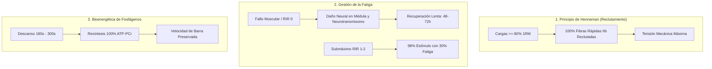
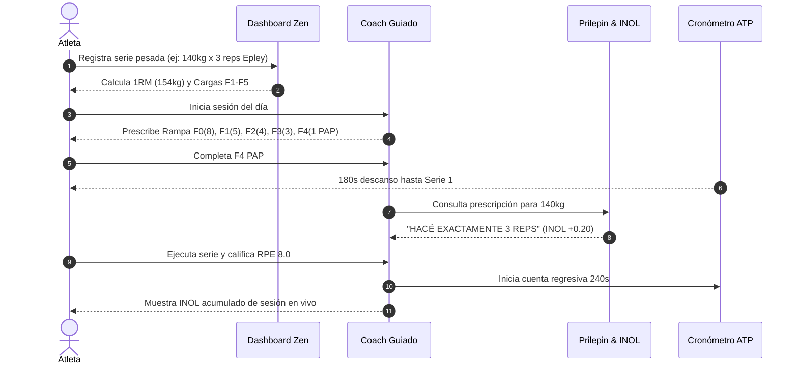

# ⚡ MANUAL DE OPERACIÓN Y PROTOCOLO CIENTÍFICO: ATP STRENGTH (NEURO//STRENGTH)
> **Versión del Sistema:** 3.4.0 • **Arquitectura:** Clean Architecture / Soviet Olympic Strength Science  
> **Propósito:** Maximizar la fuerza neuromuscular absoluta sin degradación del Sistema Nervioso Central (SNC).

---

## 1. FUNDAMENTOS CIENTÍFICOS: ¿POR QUÉ CADA COSA?

El entrenamiento de fuerza de élite no se basa en sensaciones difusas ni en agotamiento muscular (vibe coding del fitness). Se fundamenta en tres leyes biológicas y mecánicas inviolables:



### A. Principio del Tamaño de Henneman
* **Qué es:** Las unidades motoras se reclutan de menor a mayor umbral. A partir del **$80\%$ del 1RM**, el sistema nervioso ya recluta el **$100\%$ de las fibras rápidas tipo IIb** desde la primera repetición.
* **Propósito explícito en la app:** No hace falta hacer repeticiones infinitas para activar las fibras de fuerza. El estímulo óptimo se logra con series cortas y pesadas ejecutadas con máxima intención de aceleración.

### B. Fatiga Central (SNC) vs. Fatiga Periférica (Metabolismo)
* **Qué es:** Ir al fallo muscular concéntrico (RIR 0) genera fatiga sináptica central (disminución de la descarga de dopamina y acetilcolina).
* **Propósito explícito en la app:** La aplicación prescribe parar a **RIR 1–2** (1 a 2 repeticiones en reserva). Esto entrega el **$98\%$ de la señal hipertrófica y neuromuscular** reduciendo el daño central en más de un **$65\%$**.

### C. Resíntesis de Fosfocreatina (ATP-PCr)
* **Qué es:** El esfuerzo de fuerza máxima gasta las reservas de ATP en menos de 10 segundos. La creatina quinasa requiere **180 a 300 segundos** para resintetizar el 98-100% de la energía sin acudir al lactato.
* **Propósito explícito en la app:** El temporizador no es un adorno: es un cortafuegos biológico. Si levantás antes de 3 minutos, tu SNC no produce la misma potencia y degradás el reclutamiento motor.

---

## 2. GUÍA DE PANTALLAS Y COMPONENTES MILIMETRADOS

---

### I. DASHBOARD ANALÍTICO & GESTIÓN DE MARCAS

```
┌───────────────────────────────────────────────────────────────┐
│ 01// PROGRAMACIÓN Y PLANIFICACIÓN SEMANAL                      │
│ [Día A: Empuje]  [Día B: Tracción]  [Día C: Fuerza]  ...       │
├───────────────────────────────────────────────────────────────┤
│ 02// REGISTRAR MARCA / ACTUALIZAR 1RM                         │
│   Método de Cálculo:                                          │
│   ┌──────────────────────┐ ┌──────────────┐ ┌───────────────┐ │
│   │ ⚡ Estimación Submáx  │ │ 📐 Brzycki   │ │ 🎯 1RM Direct │ │
│   │ ⭐ RECOMENDADO SNC    │ │ SERIES MEDIAS│ │ ⚠️ ESTRÉS SNC │ │
│   └──────────────────────┘ └──────────────┘ └───────────────┘ │
│   Peso: [ 140 ] kg   Reps: [ 3 ] reps   RPE: [ 8.5 ]          │
│   ⚡ 1RM Estimado: 154 kg | TM (90%): 138.5 kg | F5: 117.5 kg  │
│   [ 💾 GUARDAR MARCA Y RECALCULAR CARGAS ]                    │
└───────────────────────────────────────────────────────────────┘
```

#### 1. Selector de Método de Cálculo de 1RM
| Método | Fórmula Matemática | Propósito y Objetivo Explícito | Cuándo Utilizarlo |
| :--- | :--- | :--- | :--- |
| **⚡ Estimación Submáxima (Epley)** | $P \times (1 + \frac{R}{30})$ | **Preservar el SNC.** Estima tu fuerza real testeando series pesadas sin ir al fallo. | **Método Oficial Diario / Semanal** para series de 2 a 5 repeticiones a RIR 1–2. |
| **📐 Brzycki** | $\frac{P}{1.0278 - (0.0278 \times R)}$ | Modelo conservador para series medias que evita inflar la fuerza por resistencia glucolítica. | Útil en ejercicios accesorios o series de 6 a 10 repeticiones. |
| **🎯 1RM Directo** | Medición Empírica (1 rep) | Registro de fuerza real máxima absoluta sin fórmulas. | **Solo en días de testeo o competición**. No usar semanalmente para evitar agotamiento neural. |

#### 2. Training Max (TM al 90%)
* **Propósito:** Nunca se entrena al 100% de la capacidad teórica en el día a día. El Training Max toma el 90% del 1RM como techo operativo.
* **Objetivo:** Garantizar que cada serie de trabajo mantenga velocidad de barra, técnica impoluta y margen de seguridad articular.

---

### II. MODO COACH GUIADO: LA SALA DE ENTRENAMIENTO

El Coach Guiado elimina la incertidumbre mental y ejecuta el protocolo en 2 grandes fases:

#### 1. Rampa Preparatoria Neuronal (Fases F0 a F4)
Cada fase tiene un número **determinista entero** de repeticiones sin rangos ambiguos:

```
┌───────────────────────────────────────────────────────────────┐
│ FASE                     │ REPS EXACTAS │ PROPÓSITO BIOMECÁNICO               │
├──────────────────────────┼──────────────┼─────────────────────────────────────┤
│ F0: Movilidad Articular  │ 8 reps       │ Lubricación sinovial y cápsula.     │
│ F1: Activación Dinámica  │ 5 reps       │ Barra vacía: fija el surco motor.   │
│ F2: Aproximación Liviana │ 4 reps (~50%)│ Aceleración máxima sin resistencia. │
│ F3: Aproximación Media   │ 3 reps (~70%)│ Brace intraabdominal y tensión.     │
│ F4: Activación PAP       │ 1 rep (~85%) │ Potenciación Post-Activación (PAP). │
└──────────────────────────┴──────────────┴─────────────────────────────────────┘
```

> [!IMPORTANT]
> **¿Por qué la Fase F4 (PAP) tiene exactamente 1 repetición?**  
> La Potenciación Post-Activación aprovecha la fosforilación de las cadenas ligeras de miosina. Una sola repetición pesada al 85% despierta las motoneuronas de alto umbral **sin acumular lactato ni fatiga**, haciendo que tus series efectivas posteriores se sientan más livianas y veloces.

---

#### 2. Series Efectivas de Trabajo (Fase F5)

```
┌───────────────────────────────────────────────────────────────┐
│ ⚡ OBJETIVO DETERMINISTA (SNC PROTEGIDO)                       │
│ ┌───────────────────────────┐  ┌────────────────────────────┐ │
│ │ HACÉ EXACTAMENTE 3 REPS   │  │ INOL: +0.20                │ │
│ └───────────────────────────┘  └────────────────────────────┘ │
│ 85% 1RM (Fuerza Absoluta Rusa): 3 repeticiones exactas        │
│ reclutan el 100% de motoneuronas rápidas tipo IIb a RIR 1-2.  │
├───────────────────────────────────────────────────────────────┤
│ [ - ]  PESO: 140 kg  [ + ]   │   [ - ]  REPS: 3 reps  [ + ]   │
│ [-5] [-2.5] [-1.25] [+1.25] [+2.5] [+5] [+10]                 │
│ RPE: [7.0] [7.5] [8.0] [8.5] [9.0] [9.5] [10.0]               │
│ [ ✔ COMPLETAR SERIE Y ACTIVAR CRONÓMETRO ATP ]               │
└───────────────────────────────────────────────────────────────┘
```

* **Banner de Prescripción Rusa (Prilepin):**
  * Lee el peso que tenés cargado frente a tu 1RM.
  * Prescribe el número exacto e inmutable de repeticiones (ej. 3 reps al 85%, 4 reps al 65%, 1 rep al 92%).
  * Si el input de repeticiones no coincide, un botón de snap te permite fijar la meta exacta en 1 toque.
* **Quick Plate Stepper (-5 a +10 kg):**
  * Botones ergonómicos que coinciden exactamente con los discos olímpicos estándar de gimnasio. Permite cambiar el peso en segundos sin tipear en teclado virtual.
* **Selector de Esfuerzo RPE (Tuchscherer Matrix):**
  * Registra la percepción del esfuerzo post-serie para alimentar el algoritmo de autorregulación.

---

### III. INDICADORES Y SENSORES DE CONTROL EN VIVO

#### 1. AtpEnergyRing (Anillo Radial de Fosfágenos)
* **Inspiración:** Estética Apple Watch Ultra + Tidal Luxury Dark.
* **Gradiente de Color Dinámico:**
  * `0s a 30s` (Rojo / Naranja): **Zona de Deuda de Oxígeno y Fatiga Extrema**. El músculo está acidificado.
  * `30s a 90s` (Púrpura Neón): **Resíntesis Parcial (Glucólisis Rápida)**. Niveles de energía al 50-70%.
  * `90s a 180s` (Cian Neón): **Resíntesis de Fosfágenos (ATP-PCr al 90%)**. Capacidad de aceleración restaurada.
  * `180s+` (Verde Esmeralda): **Supercompensación Neural Completa**. SNC listo para máxima potencia sin pérdida de velocidad.

#### 2. Medidor de Estrés Neural de la Sesión (INOL Acumulado)
El INOL (*Intensity Number of Lifts*) mide el costo neurológico de cada levantamiento:
$$\text{INOL} = \frac{\text{Repeticiones}}{100 - \%1\text{RM}}$$

| Rango de INOL | Estado de la Sesión | Acción del Atleta |
| :--- | :--- | :--- |
| **$< 0.4$** | `Volumen Ligero` | Calentamiento o sesión de descarga. |
| **$0.4 - 1.0$** | `Óptimo Soviético` ⭐ | **Zona ideal de ganancia de fuerza**. Máximo reclutamiento motriz con cero degradación neural. |
| **$1.0 - 1.2$** | `Carga Alta (Límite Neural)` | Esfuerzo severo. Requiere 4 minutos completos de descanso entre series. |
| **$> 1.2$** | `Sobrecarga Máxima SNC` 🛑 | **Frenar la sesión**. Seguir sumando series solo acumula daño residual y eleva el riesgo lesivo. |

---

### IV. SISTEMAS DE SOPORTE Y ERGONOMÍA MÓVIL

* **W3C Screen Wake Lock API:** Mantiene la pantalla encendida mientras descansas en el banco, evitando que el teléfono se bloquee.
* **OS Media Session API:** Al apagar la pantalla o salir de la app, el cronómetro aparece en los controles multimedia de la pantalla de bloqueo de iOS/Android con carátula e indicador de progreso.
* **Web Background Notifications:** Envía una notificación nativa y vibración cuando el descanso finaliza, incluso si estás navegando en otra app.
* **Audio Háptico y Solfeggio 528 Hz:** Emite un click táctil sub-grave de 65 Hz en cada botón y una campana armónica relajante a 528 Hz al completar el descanso.
* **Motor Offline WAL (Write-Ahead Logging):** Registra cada serie inmediatamente en el almacenamiento local criptográfico antes de intentar sincronizar con PostgreSQL. Cero pérdida de datos si se corta el WiFi del gimnasio.
* **Copia de Seguridad y Portabilidad:** Botón en el header para exportar tu historial completo en JSON o en CSV compatible con Excel.

---

## 3. PROTOCOLO OPERATIVO: PASO A PASO PARA EL ATLETA



### Regla Semanal de Sobrecarga Progresiva:
1. **¿Completaste todas las series con la cantidad exacta de reps y RPE $\le 8.5$ (RIR 1-2)?**
   * **Sí:** La próxima semana sumá **$+2.5\text{ kg}$** en tren superior o **$+5\text{ kg}$** en tren inferior (o registrá la nueva marca en el Dashboard).
2. **¿La última serie costó más de la cuenta (RPE 9.5-10) o la barra subió lenta?**
   * **No aumentes la carga:** Repetí el mismo peso la semana siguiente. El sistema nervioso necesita consolidar la mielinización de la vía motriz antes de tolerar un nuevo incremento.
