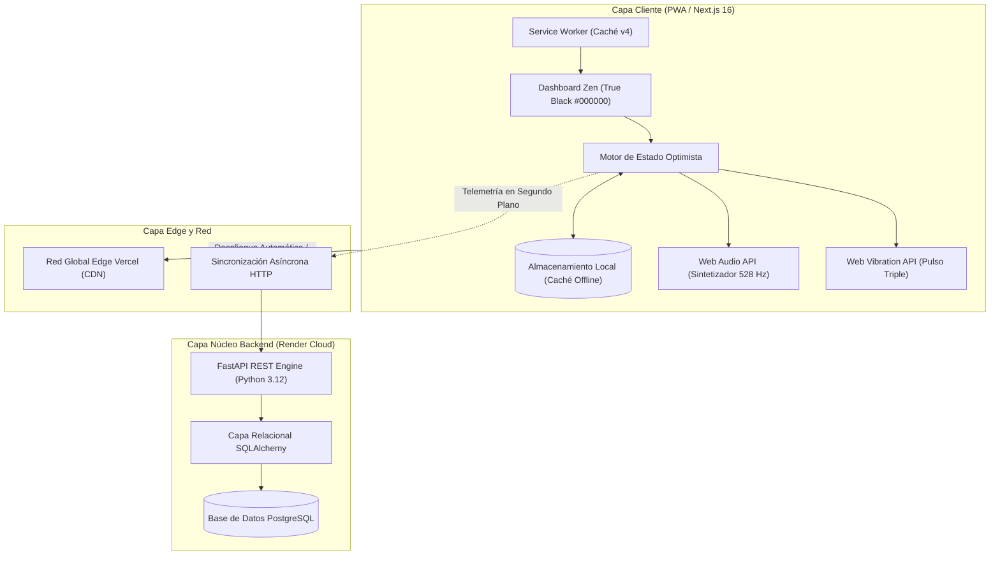

# NEURO//STRENGTH — Motor de Rendimiento Neuromuscular y Resíntesis de ATP

[](https://atp-strength.vercel.app)
[-black?style=for-the-badge&logo=next.js)](https://nextjs.org/)
[](https://react.dev/)
[](https://fastapi.tiangolo.com/)
[](https://python.org/)
[](https://www.postgresql.org/)
[](https://atp-strength.vercel.app)

> **Aplicación en Producción**: [https://atp-strength.vercel.app](https://atp-strength.vercel.app)  
> **Documentación de API**: [Swagger Interactivo FastAPI](https://atp-strength-backend.onrender.com/docs)

---

## 🎯 Resumen Ejecutivo

**NEURO//STRENGTH** es una plataforma web de entrenamiento de fuerza de élite diseñada para eliminar por completo la fricción cognitiva y la incertidumbre de carga durante esfuerzos neuromusculares máximos.

A diferencia de las aplicaciones tradicionales de gimnasio que sobrecargan al atleta con pantallas complejas en pleno estado de fatiga, NEURO//STRENGTH integra:
1. **Ergonomía de Cero Fricción**: Un flujo asistido paso a paso que le indica al atleta la carga exacta, las repeticiones obligatorias y el montaje de discos por manga para cada serie.
2. **Resíntesis Fisiológica de Fosfágenos (ATP-PCr)**: Control estricto de descansos de 3 a 5 minutos, garantizando la recuperación bioquímica completa de motoneuronas de alto umbral antes de cada levantamiento.
3. **Síntesis Acústica y Háptica en el Dispositivo**: Generación sintética nativa mediante Web Audio API (frecuencia armónica de 528 Hz) y alertas hápticas de bolsillo (`navigator.vibrate`), permitiendo entrenar sin mirar la pantalla.
4. **Resiliencia Offline-First**: Arquitectura Progressive Web App (PWA) con almacenamiento optimista en `localStorage`, garantizando funcionamiento continuo en sótanos o zonas sin cobertura móvil.

---

## 🏛️ Arquitectura del Sistema

La solución adopta una **Arquitectura Desacoplada y Resiliente** orientada a alta disponibilidad y latencia cero:



---

## ⚡ Características Clave de Ingeniería

### 1. Experiencia de Usuario Guiada ("Cero Cálculo Mental Bajo Fatiga")
- **Flujo Secuencial Asistido**: Guía estructurada desde la **Fase 1 de Activación**, pasando por aproximaciones medias y **Fase 4 PAP (Potenciación Post-Activación)**, hasta las **Series Efectivas de Trabajo**.
- **Botón de Acción Principal (CTA) Adaptativo**: Control ergonómico único que responde al estado exacto de la sesión:
  - *En Descanso*: `⏱️ DESCANSO ACTIVO (mm:ss) • SALTAR Y LEVANTAR YA`
  - *En Calentamiento*: `¡FASE X REALIZADA! → PASAR A FASE X+1`
  - *En Serie Efectiva*: `¡SERIE X REALIZADA! → ENTRAR EN DESCANSO ATP`
  - *Al Finalizar Sesión*: `🏆 ¡ENTRENAMIENTO COMPLETADO! → VER RESUMEN`
- **Ergonomía Táctil de Gimnasio**: Botones con áreas táctiles mínimas de 44×44px y respuesta háptica táctil (`active:scale-95`), diseñados para dedos con magnesio o fatiga motora.

### 2. Autorregulación Científica de 1RM y Aclimatación SNC
- **5 Modelos Biomecánicos Validados**: Soporte integrado para las fórmulas de Epley, Brzycki, Lander, Lombardi y Mayhew.
- **Training Max (TM) al 90%**: Tope de seguridad neuromuscular que previene el sobreentrenamiento sistémico del Sistema Nervioso Central.
- **Telemetría de Montaje de Discos**: Desglose automático de kilos por manga para barras olímpicas de 20 kg, barras Z de 10 kg, mancuernas y peso corporal lastrado.

### 3. Bio-Acústica y Señalización Háptica Integradas
- **Generación Acústica Sintética (Cero Descargas MP3)**: Utiliza Web Audio API para sintetizar en tiempo real la frecuencia Solfeggio de 528 Hz con armónicos a 880 Hz y 1056 Hz, eliminando latencia de red y dependencias de archivos multimedia.
- **Fanfarria Armónica Triunfal**: Progresión melódica ascendente (*Do5 → Mi5 → Sol5 → Do6*) ejecutada automáticamente al completar la sesión diaria.
- **Pulso Háptico Triple de Bolsillo**: Secuencia rítmica `[300ms, 150ms, 300ms, 150ms, 500ms]` perceptible en el pantalón para avisar el fin del descanso sin contacto visual.

### 4. Analítica de Sesión y Tonelaje Total Acumulado
- **Motor de Tonelaje Gravitacional**: Cuantificación matemática de la masa bruta desplazada contra la gravedad:
  $$\text{Tonelaje} = \sum (\text{Series} \times \text{Repeticiones} \times \text{Carga}_{\text{kg}})$$
- **Auditoría de Rendimiento**: Resumen con insignias de cumplimiento por ejercicio y fundamentos fisiológicos de supercompensación neuromuscular.

### 5. Control de Reinicio Seguro y No Destructivo
- **Confirmación en Dos Niveles**: Modal de seguridad que permite reiniciar únicamente el ejercicio activo o bien la totalidad de la sesión del día.
- Protege los registros históricos y las marcas 1RM contra eliminaciones accidentales.

---

## 🛠️ Stack Tecnológico Justificado

| Capa | Tecnología | Justificación Técnica |
|---|---|---|
| **Framework Frontend** | **Next.js 16.3.4 (Turbopack)** | Renderizado híbrido con React 19, compilación en milisegundos y pre-renderizado estático optimizado. |
| **Diseño y Estilos** | **Tailwind CSS v4 + Vanilla CSS** | Paleta personalizada de alto contraste en True Black (`#000000`), reduciendo el consumo energético en pantallas OLED. |
| **Estado y Caché Local** | **React Hooks + localStorage + SW** | Actualizaciones locales instantáneas (sub-milisegundo) con persistencia offline garantizada. |
| **Acústica y Hápticos** | **Web Audio API + Web Vibration API** | Generación de sonido y vibración puramente nativa en el dispositivo, sin carga de red ni dependencias externas. |
| **Framework Backend** | **FastAPI (Python 3.12)** | Microframework asíncrono ASGI de alto rendimiento con validación tipada estricta vía Pydantic y OpenAPI automático. |
| **Base de Datos y ORM** | **PostgreSQL + SQLAlchemy** | Persistencia relacional transaccional y robusta para telemetría histórica de levantamientos y marcas de fuerza. |
| **Infraestructura Cloud** | **Vercel + Render** | Distribución Edge global en CDN para el cliente web combinada con servicios administrados para la API Python. |

---

## 📁 Estructura del Repositorio

```text
atp-strength/
├── 📂 atp-strength-frontend/             # Aplicación de Producción Next.js 16
│   ├── 📂 public/
│   │   ├── sw.js                         # Service Worker (Caché v4, Estrategia Network-First)
│   │   ├── manifest.webmanifest          # Manifiesto PWA Standalone
│   │   └── icon-*.png                    # Iconos adaptativos de alta resolución
│   ├── 📂 src/
│   │   ├── 📂 app/
│   │   │   ├── layout.tsx                # Metadatos globales, optimización SEO y tema oscuro
│   │   │   ├── page.tsx                  # Dashboard Zen, motor de fuerza y flujo de entrenamiento
│   │   │   └── globals.css               # Tokens de diseño y animaciones de resíntesis
│   │   └── 📂 components/
│   │       └── PwaInstallPrompt.tsx      # Componente de instalación nativa PWA
│   ├── next.config.ts                    # Configuración del compilador Turbopack
│   ├── vercel.json                       # Orquestación de despliegue en Vercel
│   └── package.json                      # Dependencias y scripts del frontend
│
├── 📂 atp-strength-backend/              # API Núcleo en Python FastAPI
│   ├── 📂 src/
│   │   ├── 📂 config/                    # Configuración de conexiones PostgreSQL
│   │   ├── 📂 domain/                    # Esquemas de datos SQLAlchemy y modelos de dominio
│   │   ├── 📂 repository/                # Abstracción de acceso a datos
│   │   └── 📂 routes/
│   │       ├── state.py                  # Endpoints de series (/api/state/log-set)
│   │       └── strength.py               # Endpoints de 1RM (/api/strength/maxes)
│   ├── main.py                           # Punto de entrada de la API y middleware CORS
│   ├── requirements.txt                  # Dependencias bloqueadas de Python
│   └── render.yaml                       # Infraestructura como Código (IaC) para Render Cloud
│
└── README.md                             # Documentación técnica corporativa
```

---

## 🚀 Puesta en Marcha Local

### Prerrequisitos
- **Node.js**: `v20.x` o superior
- **Python**: `3.12.x`
- **PostgreSQL**: `v15` o superior (opcional para pruebas con base local)

### 1. Clonar el Repositorio
```bash
git clone https://github.com/valentinflorezarbelaez-ai/ATP-STRENGTH.git
cd ATP-STRENGTH
```

### 2. Configuración del Backend (FastAPI)
```bash
cd atp-strength-backend

# Crear y activar entorno virtual
python -m venv .venv
source .venv/bin/activate    # En Windows: .venv\Scripts\activate

# Instalar dependencias
pip install -r requirements.txt

# Iniciar servidor de desarrollo
uvicorn main:app --reload --port 8000
```
> La interfaz Swagger interactiva estará disponible en: `http://localhost:8000/docs`.

### 3. Configuración del Frontend (Next.js)
```bash
cd ../atp-strength-frontend

# Instalar paquetes
npm install

# Iniciar servidor de desarrollo
npm run dev
```
> Accede a `http://localhost:3000` para interactuar con el Dashboard de **NEURO//STRENGTH**.

---

## 🔒 Estándares de Código y Calidad

- **Conventional Commits**: Adherencia rigurosa al estándar de commits convencionales (`feat`, `fix`, `chore`, `docs`).
- **TypeScript Estricto**: Cobertura tipada al 100% sin uso de `any` laxos en la lógica de negocio.
- **Autoría Limpia**: Sin atribuciones automatizadas ni marcas de agua de herramientas externas en los commits.
- **Seguridad y Sanitización**: Variables de entorno desacopladas de credenciales maestras y registros de cliente depurados.

---

## 📄 Licencia

Desarrollado por **Valentin Florez** bajo licencia de código abierto para acondicionamiento neuromuscular y autorregulación de fuerza de alto rendimiento.

Distribuido bajo la **Licencia MIT**.
