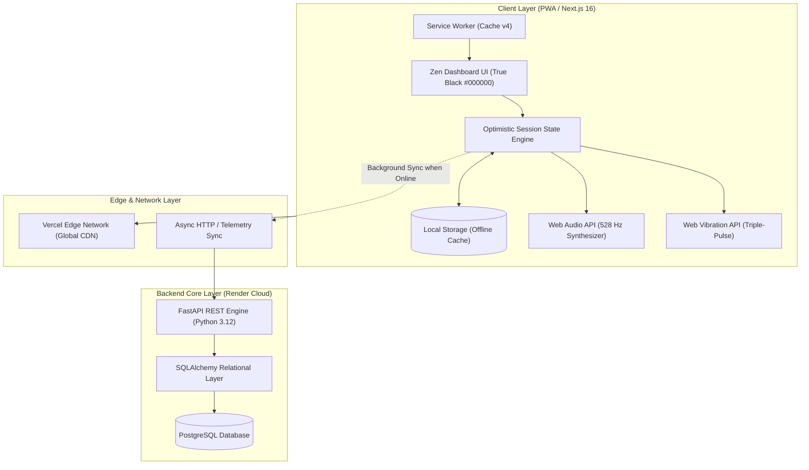

# NEURO//STRENGTH — High-Performance Neuromuscular & ATP Resynthesis Engine

[](https://atp-strength.vercel.app)
[-black?style=for-the-badge&logo=next.js)](https://nextjs.org/)
[](https://react.dev/)
[](https://fastapi.tiangolo.com/)
[](https://python.org/)
[](https://www.postgresql.org/)
[](https://atp-strength.vercel.app)

> **Live Application**: [https://atp-strength.vercel.app](https://atp-strength.vercel.app)  
> **API Documentation**: [FastAPI Interactive Swagger Docs](https://atp-strength-backend.onrender.com/docs)

---

## 🎯 Executive Overview

**NEURO//STRENGTH** is an elite strength-training web application engineered to eliminate cognitive friction and biomechanical guesswork during maximal neuromuscular efforts. 

Unlike standard fitness loggers that overwhelm athletes under heavy fatigue, NEURO//STRENGTH combines:
1. **Zero-Friction Ergonomics**: Prescriptive, step-by-step guidance telling the lifter the exact load, repetitions, and bar assembly for every set.
2. **Physiological Phosphagen (ATP-PCr) Resynthesis**: Mandatory recovery timer enforcing biochemical replenishment (3–5 min) for motor unit readiness.
3. **Native Synthetic Audio & Pocket Haptics**: Browser-synthesized Solfeggio 528 Hz harmonics and triple-pulse haptic alerts (`navigator.vibrate`) notifying the lifter without requiring visual contact.
4. **Offline-First Resilience**: Full standalone PWA functionality capable of uninterrupted operation in shielded gym basements.

---

## 🏛️ System Architecture

The application adopts a **Decoupled, Resilient Client-Server Architecture** designed for high availability and zero operational lag:



---

## ⚡ Key Engineering Features

### 1. Zero-Friction Guided UX ("No Mental Math Under Load")
- **Step-by-Step Flow**: Progresses sequentially from **Phase 1 Activation** through **Phase 4 PAP (Post-Activation Potentiation)** to **Phase 5 Work Sets**.
- **Dynamic Contextual CTA**: Single prominent touch action that adapts automatically:
  - *Resting*: `⏱️ REST ACTIVE (mm:ss) • SKIP & LIFT NOW`
  - *Warmup*: `PHASE X COMPLETED → PROCEED TO PHASE X+1`
  - *Work Set*: `SET X COMPLETED → START ATP REST`
  - *Session Finish*: `SESSION COMPLETED → VIEW VICTORY SUMMARY`
- **Ergonomic Touch Targets**: Minimum 44×44px touch boundaries with reactive feedback (`active:scale-95`) optimized for chalk-covered or sweaty hands.

### 2. Scientific 1RM Autoregulation & CNS Acclimatization
- **5 Validated Biomechanical Equations**: Epley, Brzycki, Lander, Lombardi, and Mayhew models for precise max-strength estimation.
- **90% Training Max (TM) Ceiling**: Guards against systemic Central Nervous System (CNS) overtraining.
- **Exact Bar Assembly Telemetry**: Automatically calculates plate weight per sleeve for 20 kg Olympic bars, 10 kg EZ bars, dumbbells, and weighted bodyweight.

### 3. Integrated Bio-Acoustic & Haptic Telemetry
- **Synthetic Web Audio Generation**: Zero external MP3 downloads. Directly synthesizes a 528 Hz fundamental Solfeggio frequency with 880 Hz and 1056 Hz warm harmonics and exponential decay.
- **Triumphant Fanfare**: Synthesizes an ascending musical chord (*C5 → E5 → G5 → C6*) upon session completion.
- **Deep Pocket Haptic Signal**: Emits a potent `[300ms, 150ms, 300ms, 150ms, 500ms]` triple pulse so the lifter feels readiness through gym shorts.

### 4. Session Victory Modal & Total Tonnage Analytics
- **Cumulative Tonnage Engine**: Calculates total gravitational mass moved across all working and warm-up sets:
  $$\text{Tonnage} = \sum (\text{Sets} \times \text{Reps} \times \text{Load}_{\text{kg}})$$
- **Performance Breakdown**: Full exercise audit with completion badges and physiological supercompensation insights.

### 5. Non-Destructive Reset Architecture
- **Two-Tier Safe Reset**: Differentiates between resetting only the active exercise (clearing its current sets) versus resetting the entire daily session.
- Prevents accidental data loss while keeping 1RM historical records intact.

---

## 🛠️ Technology Stack

| Layer | Technology | Rationale |
|---|---|---|
| **Frontend Framework** | **Next.js 16.3.4 (Turbopack)** | React 19 Server/Client components with sub-second compilation and static prerendering. |
| **Styling & Design System** | **Tailwind CSS v4 + Vanilla CSS** | Custom HSL tailored dark-mode tokens with True Black (`#000000`) OLED power optimization. |
| **State & Offline Storage** | **React Hooks + localStorage + SW** | Immediate sub-millisecond local updates with reliable background synchronization. |
| **Audio & Device Telemetry** | **Web Audio API + Web Vibration API** | Zero-latency, zero-asset client-side synthesized acoustics and physical haptics. |
| **Backend Framework** | **FastAPI (Python 3.12)** | High-throughput asynchronous ASGI microframework with automatic OpenAPI validation. |
| **Database & ORM** | **PostgreSQL + SQLAlchemy** | ACID-compliant relational storage for longitudinal athlete performance metrics. |
| **Deployment & Hosting** | **Vercel + Render** | Edge-accelerated frontend distribution coupled with managed containerized backend services. |

---

## 📁 Repository Structure

```text
atp-strength/
├── 📂 atp-strength-frontend/             # Next.js 16 Production Application
│   ├── 📂 public/
│   │   ├── sw.js                         # Service Worker (Cache v4, Network-First Strategy)
│   │   ├── manifest.webmanifest          # PWA Standalone Manifest
│   │   └── icon-*.png                    # High-DPI App & Maskable Icons
│   ├── 📂 src/
│   │   ├── 📂 app/
│   │   │   ├── layout.tsx                # Viewport metadata, SEO tags, dark-mode root
│   │   │   ├── page.tsx                  # Zen Engine Dashboard & Full Workout Flow
│   │   │   └── globals.css               # Kinetic animations & luxury dark tokens
│   │   └── 📂 components/
│   │       └── PwaInstallPrompt.tsx      # Native PWA installation interface
│   ├── next.config.ts                    # Edge and Turbopack compiler configuration
│   ├── vercel.json                       # Vercel deployment orchestration
│   └── package.json                      # Frontend dependencies & scripts
│
├── 📂 atp-strength-backend/              # Python FastAPI Core API
│   ├── 📂 src/
│   │   ├── 📂 config/                    # PostgreSQL connection & engine configuration
│   │   ├── 📂 domain/                    # SQLAlchemy data schemas & domain models
│   │   ├── 📂 repository/                # Data access abstractions
│   │   └── 📂 routes/
│   │       ├── state.py                  # Telemetry endpoints (/api/state/log-set)
│   │       └── strength.py               # 1RM engine endpoints (/api/strength/maxes)
│   ├── main.py                           # Application bootstrap, CORS middleware
│   ├── requirements.txt                  # Locked Python dependencies
│   └── render.yaml                       # Infrastructure-as-Code for Render Cloud
│
└── README.md                             # Enterprise architectural documentation
```

---

## 🚀 Getting Started Locally

### Prerequisites
- **Node.js**: `v20.x` or higher
- **Python**: `3.12.x`
- **PostgreSQL**: `v15` or higher (optional for local mock testing)

### 1. Clone the Repository
```bash
git clone https://github.com/valentinflorezarbelaez-ai/ATP-STRENGTH.git
cd ATP-STRENGTH
```

### 2. Backend Setup (FastAPI)
```bash
cd atp-strength-backend

# Initialize virtual environment
python -m venv .venv
source .venv/bin/activate    # On Windows: .venv\Scripts\activate

# Install dependencies
pip install -r requirements.txt

# Start API server
uvicorn main:app --reload --port 8000
```
> The interactive Swagger UI will be live at `http://localhost:8000/docs`.

### 3. Frontend Setup (Next.js)
```bash
cd ../atp-strength-frontend

# Install dependencies
npm install

# Run development server
npm run dev
```
> Open `http://localhost:3000` to launch the **NEURO//STRENGTH** Dashboard.

---

## 🔒 Security & Code Standards

- **Conventional Commits**: Strict adherence to Conventional Commits specification (`feat`, `fix`, `chore`, `docs`).
- **Strict TypeScript**: 100% type coverage without loose `any` casts in core business logic.
- **Zero AI Attribution**: Clean author commits devoid of automated tool watermarks.
- **Privacy & Sanitization**: Stripped client logs and protected database credential configurations.

---

## 📄 License & Attribution

Developed by **Valentin Florez** as an open, high-performance architecture framework for neuromuscular conditioning and elite strength autoregulation.

Distributed under the **MIT License**.
