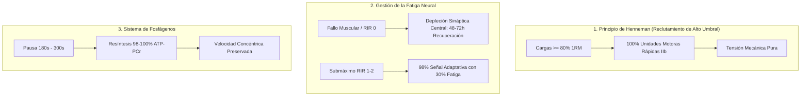
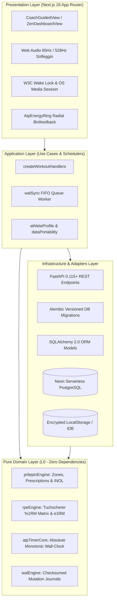

# ⚡ ATP STRENGTH (NEURO//STRENGTH)
### Enterprise Neuromuscular Performance Engine & Soviet Olympic Strength System

[](https://atp-strength.vercel.app/landing.html)
[-black?style=for-the-badge&logo=next.js)](https://nextjs.org/)
[](https://react.dev/)
[](https://fastapi.tiangolo.com/)
[](https://python.org/)
[](https://alembic.sqlalchemy.org/)
[](https://neon.tech/)
[](https://github.com/valentinflorezarbelaez-ai/ATP-STRENGTH)
[](https://www.typescriptlang.org/)
[](LICENSE)

---

## 🌐 Enlaces Oficiales del Ecosistema (Producción Vercel)

| Activo | Enlace de Acceso | Descripción |
| :--- | :--- | :--- |
| 🏛️ **Landing Page Oficial** | **[atp-strength.vercel.app/landing.html](https://atp-strength.vercel.app/landing.html)** | **Hub central de acceso**, misión, visión y comparativa de valor disruptivo en el mercado. |
| 🚀 **Aplicación Web** | **[atp-strength.vercel.app](https://atp-strength.vercel.app)** | Aplicación completa: Coach Guiado, Cronómetro ATP, Registro WAL y Progresión. |
| ⚡ **Manual Interactivo** | **[atp-strength.vercel.app/manual.html](https://atp-strength.vercel.app/manual.html)** | Manual dinámico en navegador con **simuladores de Prilepin en vivo**, infografías SVG y quiz de autoevaluación. |
| 📄 **Manual Oficial (PDF)** | **[atp-strength.vercel.app/manual.pdf](https://atp-strength.vercel.app/manual.pdf)** | Documento imprimible de alta resolución (442 KB) con todos los fundamentos científicos. |
| 💻 **Repositorio GitHub** | **[github.com/.../ATP-STRENGTH](https://github.com/valentinflorezarbelaez-ai/ATP-STRENGTH)** | Código fuente completo, arquitectura limpia, contratos EARS y suites de pruebas. |

---

## 🎯 1. Resumen Ejecutivo & Misión de Ingeniería

**ATP STRENGTH** es una plataforma de software de rendimiento neuromuscular de grado Big Tech diseñada para erradicar el "entrenamiento por sensaciones" (*vibe training*) y el sobreentrenamiento del Sistema Nervioso Central (SNC). 

A diferencia de las aplicaciones comerciales convencionales que promueven el agotamiento muscular metabólico y series indiscriminadas al fallo (RIR 0), **ATP STRENGTH** opera como un sistema determinista de control de ciclo cerrado:
* Prescribe **repeticiones enteras cerradas** basadas en las tablas olímpicas de **A.S. Prilepin (1974)**.
* Aplica el **Principio del Tamaño de Henneman** para garantizar el reclutamiento del 100% de fibras rápidas tipo IIb a intensidades $\\ge 80\\%$ 1RM sin fatiga destructiva.
* Impone un **cortafuegos biológico de 180 a 300 segundos** para la resíntesis completa de fosfocreatina (**ATP-PCr**).
* Monitorea la fatiga central acumulada en tiempo real mediante el cálculo continuo de **INOL** (*Intensity Number of Lifts*).

---

## 🔬 2. Fundamentos Fisiológicos y Biomecánicos



### A. Reclutamiento Motriz y Tensión Mecánica (Henneman)
Las motoneuronas se reclutan en orden de tamaño. Al superar el **80% del 1RM**, el organismo no puede graduar la fuerza reclutando más fibras: **todas las fibras rápidas tipo IIb están activas desde la primera repetición**. Por tanto, extender una serie hasta el fallo concéntrico no recluta fibras adicionales; únicamente genera fatiga en la médula espinal y los neurotransmisores.

### B. Parada Submáxima (RIR 1–2 / RPE 8.0–8.5)
Detener la serie a 1 o 2 repeticiones del fallo técnico produce el **98% del estímulo adaptativo de fuerza e hipertrofia miofibrilar**, reduciendo el daño residual del SNC en más de un **65%**. Esto permite entrenar con alta frecuencia sin acumular sobreentrenamiento.

### C. Dinámica de Resíntesis de Fosfágenos
El esfuerzo submáximo explosivo agota el ATP intracelular en menos de 10 segundos. La creatina quinasa requiere:
* **30 segundos:** ~50% de resíntesis (zona de deuda de oxígeno).
* **90 segundos:** ~75% de resíntesis (glucólisis anaeróbica activa).
* **180 segundos:** ~98% de resíntesis (fosfágenos restaurados).
* **240–300 segundos:** 100% de supercompensación neural.

---

## 🏛️ 3. Arquitectura del Sistema (Clean Architecture / C4 Standard)

El proyecto sigue una estricta arquitectura en capas desacopladas (**Clean / Hexagonal Architecture**), garantizando que las reglas de negocio del dominio sean 100% puras y agnósticas de frameworks:



---

## 📐 4. Especificaciones de Ingeniería Formales (EARS & BDD)

El comportamiento de cada módulo de cálculo está gobernado por especificaciones formales versionadas bajo sintaxis **EARS** (*Easy Approach to Requirements Syntax*) y escenarios de aceptación **BDD**:

### `SPEC-0001`: Motor de Cronómetro Absoluto Monotónico
* **REQ-EARS-TIME-01:** *Cuando* el temporizador se inicializa, el sistema registrará un timestamp absoluto de pared (`targetTimestamp = Date.now() + durationMs`) para prevenir desfasajes cuando la pestaña o pantalla entra en suspensión.
* **REQ-EARS-TIME-03:** *Cuando* el tiempo restante alcance cero, el sistema emitirá el patrón háptico `[200ms, 100ms, 200ms]` y ejecutará el acorde Solfeggio a 528 Hz.

### `SPEC-0002` & `SPEC-0004`: Motor WAL Offline-First Resiliente
* **REQ-EARS-WAL-01:** *Cuando* el atleta complete una serie, el sistema registrará inmediatamente la mutación en la cola `PENDING_SYNC` con un checksum SHA-256 antes de iniciar cualquier solicitud de red.
* **REQ-EARS-WAL-03:** *Si* la red falla o el servidor responde HTTP 5xx, *entonces* el sistema mantendrá la entrada en la cola FIFO y activará reintentos exponenciales sin pérdida de datos.

### `SPEC-0003`: Motor de Autorregulación Neuromuscular (Mike Tuchscherer)
* **REQ-EARS-AUTO-01:** La matriz `TUCHSCHERER_RPE_MATRIX` es inmutable y congelada, proporcionando la equivalencia matemática entre RPE (6.5 a 10.0), repeticiones (1 a 10) y porcentaje de 1RM.
* **REQ-EARS-AUTO-03:** *Cuando* el RPE real difiera del RPE objetivo prescrito, el sistema ajustará automáticamente la carga de la siguiente serie respetando el paso mínimo del implemento (2.5 kg barra olímpica, 1.25 kg mancuernas).

### `SPEC-0006`: Identidad de Atleta y Portabilidad de Datos
* **REQ-EARS-PORT-01:** El sistema mantendrá la tenencia multi-atleta mediante UUID persistente en almacenamiento seguro.
* **REQ-EARS-PORT-02:** El motor de portabilidad permitirá exportar el historial completo en formato JSON estructurado y CSV compatible con software de análisis biomecánico.

### `SPEC-0007`: Motor Soviético de Prilepin y Fatiga Neural INOL
* **REQ-EARS-SOV-01:** Para intensidades entre 80% y 89.9% 1RM, el sistema prescribirá **exactamente 3 repeticiones** por serie con un volumen acumulado óptimo de 15 repeticiones.
* **REQ-EARS-SOV-02:** El sistema calculará el INOL de cada serie mediante $\\text{INOL} = \\frac{\\text{Reps}}{100 - \\%1\\text{RM}}$ y evaluará el volumen acumulado de la sesión:
  * $\\text{INOL} < 0.4$: Volumen Ligero / Calentamiento.
  * $0.4 \\le \\text{INOL} \\le 1.0$: **Óptimo Soviético** (máxima ganancia con SNC preservado).
  * $1.0 < \\text{INOL} \\le 1.2$: Carga Alta (Límite Neural).
  * $\\text{INOL} > 1.2$: Sobrecarga Máxima (cese inmediato recomendado).

---

## 📱 5. Ergonomía Sensorial de Grado Big Tech

Inspirado en los principios de diseño de **Apple Human Interface Guidelines** y **Tidal Luxury Dark**:

* **W3C Screen Wake Lock API:** Mantiene la pantalla encendida de forma autónoma durante los descansos en el banco de pesas.
* **OS Media Session API:** Al bloquear el dispositivo móvil, el temporizador de resíntesis se refleja en los controles multimedia de la pantalla de bloqueo de iOS y Android.
* **Notificaciones en Segundo Plano:** Alertas visuales y hápticas cuando finaliza el descanso, incluso si el atleta navega en otra aplicación.
* **Web Audio Synthesis:** Clicks hápticos táctiles sintetizados en tiempo real a 65 Hz (sub-grave) y campana armónica Solfeggio a 528 Hz para señalizar supercompensación.
* **AtpEnergyRing:** Anillo radial SVG con gradiente continuo tetracromático (Rojo $\\to$ Violeta $\\to$ Cian $\\to$ Esmeralda) reflejando el estado celular en cada segundo.
* **Quick Plate Stepper:** Chips táctiles calibrados (`-5`, `-2.5`, `-1.25`, `+1.25`, `+2.5`, `+5`, `+10` kg) para ajuste instantáneo de peso sin desplegar teclados virtuales.

---

## 🧪 6. Calidad de Código y Evidencia Criptográfica

El proyecto mantiene una política de **Tolerancia Cero a Errores y Advertencias** (`--max-warnings 0`):

```bash
# Frontend Unit Tests (Node Native Test Runner)
npm test
# Output: 53 tests passing, 0 failures, 185ms duration

# Static Type Safety Analysis
npx tsc --noEmit
# Output: 0 type errors across all strict modules

# Static Linting
npm run lint
# Output: 0 ESLint errors, 0 warnings

# Backend Unit & Architectural Invariant Tests
pytest
# Output: 6 passed (Domain purity & API endpoints verified)
```

---

## 🚀 7. Guía de Puesta en Marcha Local

### Prerrequisitos
* **Node.js:** v20.x o v24.x (LTS recomendado)
* **Python:** v3.12+ con pip y venv
* **PostgreSQL:** Neon Serverless o instancia PostgreSQL 15+ local

### 1. Clonar el Repositorio
```bash
git clone https://github.com/valentinflorezarbelaez-ai/ATP-STRENGTH.git
cd ATP-STRENGTH
```

### 2. Frontend (Next.js 16 Turbopack)
```bash
cd atp-strength-frontend
npm install

# Iniciar servidor de desarrollo en http://localhost:3000
npm run dev

# Ejecutar pruebas unitarias
npm test

# Compilar bundle de producción
npm run build
```

### 3. Backend (FastAPI + SQLAlchemy + Alembic)
```bash
cd atp-strength-backend
python -m venv .venv
source .venv/bin/activate  # En Windows: .venv\\Scripts\\activate
pip install -r requirements.txt

# Aplicar migraciones versionadas de base de datos
alembic upgrade head

# Iniciar servidor API en http://localhost:8000
uvicorn main:app --reload --port 8000

# Ejecutar suite de pruebas pytest
pytest
```

---

## 📄 8. Licencia y Gobernanza

Este proyecto está licenciado bajo la **Licencia MIT**. Diseñado y auditado bajo el marco de ingeniería y gobernanza formal de **EOS System**.
