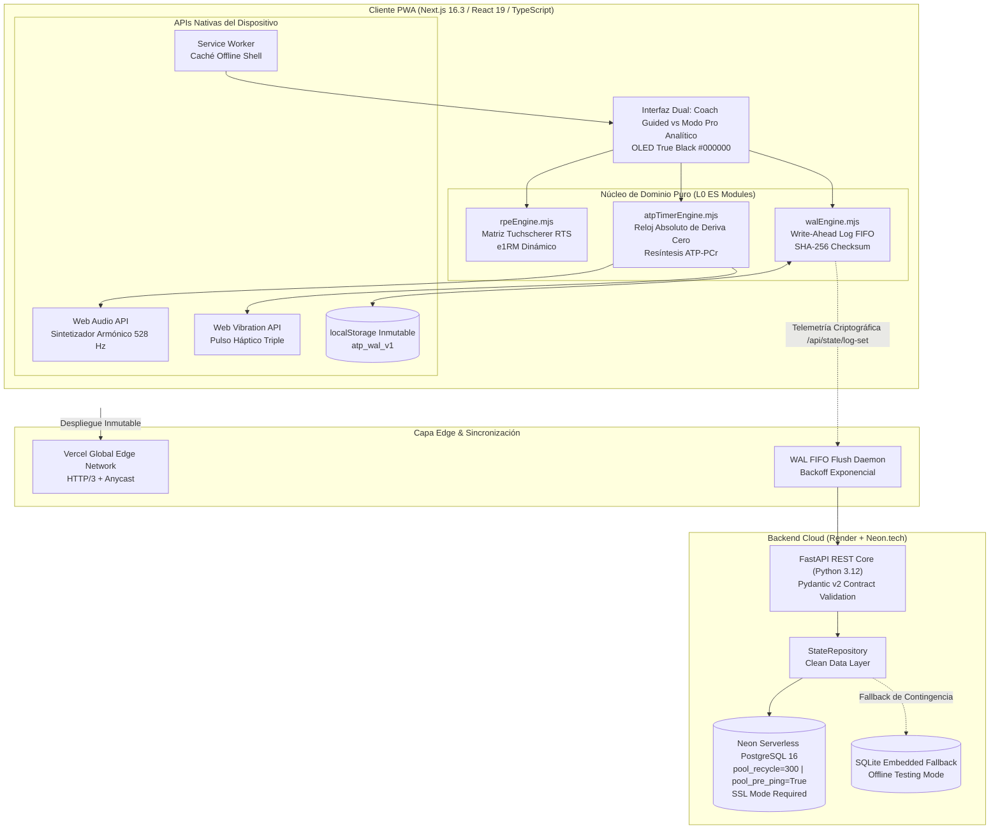

# NEURO//STRENGTH — Motor de Rendimiento Neuromuscular y Resíntesis de ATP

[](https://atp-strength.vercel.app)
[-black?style=for-the-badge&logo=next.js)](https://nextjs.org/)
[](https://react.dev/)
[](https://fastapi.tiangolo.com/)
[](https://python.org/)
[](https://neon.tech/)
[](https://atp-strength.vercel.app)
[-brightgreen?style=for-the-badge&logo=node.js)](https://atp-strength.vercel.app)

> **Aplicación en Producción**: [https://atp-strength.vercel.app](https://atp-strength.vercel.app)  
> **Documentación Interactiva Swagger / OpenAPI**: [Swagger UI FastAPI](https://atp-strength-backend.onrender.com/docs)  
> **Control de Especificaciones**: Gobernado por el sistema autónomo **EOS** bajo el estándar formal IEEE 830 / ISO 29148.

---

## 🎯 Resumen Ejecutivo & Misión de Ingeniería

**NEURO//STRENGTH** es una plataforma de software de élite para atletas de fuerza máxima y halterofilia, construida para erradicar la sobrecarga cognitiva y la fatiga mental durante el entrenamiento. 

Bajo esfuerzos supra-máximos ($>85\%\text{ 1RM}$), el Sistema Nervioso Central (SNC) y las motoneuronas alfa sufren una depresión transitoria severa. En ese estado, obligar al atleta a calcular porcentajes de fatiga, conversiones de RPE o tiempos de descanso produce degradación técnica y riesgo de lesión.

NEURO//STRENGTH resuelve esto mediante:
1. **Arquitectura Hexagonal Pura (L0 Domain)**: Motores determinísticos desacoplados de frameworks (`rpeEngine.mjs`, `walEngine.mjs`, `atpTimerEngine.mjs`) testeados en milisegundos con Node.js nativo.
2. **Autorregulación Dinámica de Mike Tuchscherer (RTS)**: Cálculo reactivo de Reps in Reserve (RIR) y 1RM estimado ($e1RM$) con ajuste adaptativo de fatiga entre series.
3. **Resiliencia de Datos Offline-First (WAL)**: Registro inmutable con suma de comprobación criptográfica SHA-256 (`atp_wal_v1`) y reintento FIFO tolerante a fallos de red.
4. **Resíntesis Bioquímica de ATP-PCr con Frecuencia Solfeggio (528 Hz)**: Sintetizador nativo Web Audio API y pulso háptico de bolsillo (`navigator.vibrate`) que independizan al usuario de la pantalla.
5. **Ergonomía Visual OLED True Black (`#000000`)**: Contraste bio-ergonómico total con gasto de batería mínimo en pantallas AMOLED.

---

## 🏛️ Diagrama de Arquitectura del Sistema



---

## 📐 Especificaciones de Ingeniería Formales (EARS & BDD)

Todo el desarrollo de NEURO//STRENGTH está formalizado bajo el estándar **IEEE 830 / ISO 29148** con sintaxis EARS y validación de escenarios BDD (Given-When-Then):

### 1. Motor de Autorregulación Neuromuscular (`SPEC-0003`)
* **[REQ-EARS-AUTO-01] (Ubiquitous - Consulta Matricial RTS)**:  
  EL SISTEMA mapea de forma determinística cualquier par de repeticiones ($1 \le \text{reps} \le 10$) y RPE ($6.5 \le \text{RPE} \le 10.0$ en pasos de 0.5) al coeficiente de intensidad $\%1\text{RM}$ oficial de Mike Tuchscherer.
* **[REQ-EARS-AUTO-02] (Event-Driven - $e1RM$ Dinámico)**:  
  CUANDO el atleta completa una serie con carga ($kg > 0$), repeticiones y percepción de esfuerzo RPE, EL SISTEMA calcula el 1RM estimado instantáneo:
  $$e1RM = \frac{\text{Carga Levada}}{\%1RM(\text{reps}, \text{RPE})}$$
* **[REQ-EARS-AUTO-03] (State-Driven - Prescripción Adaptativa de Carga)**:  
  MIENTRAS la sesión tenga series de trabajo pendientes, EL SISTEMA recalcula la carga recomendada para la siguiente serie en función del *overshoot* (sobreesfuerzo) o *undershoot* (supercompensación) experimentado.

```gherkin
Scenario: Ajuste adaptativo tras un sobreesfuerzo imprevisto (RPE Overshoot)
  Dado que el atleta tiene prescritas 3 repeticiones con carga objetivo @ RPE 8.0
  Y ejecuta la serie con 140 kg pero experimenta una fatiga imprevista de RPE 9.5
  Cuando el motor de autorregulación procesa la telemetría de la serie
  Entonces detecta un overshoot de +1.5 RPE y calcula un e1RM degradado de 154.4 kg
  Y ajusta la prescripción de la siguiente serie a 132.5 kg (-7.5 kg de descarga)
  Y preserva la velocidad de ejecución y la integridad del SNC.
```

### 2. Motor de Sincronización WAL Offline-First (`SPEC-0002` & `SPEC-0004`)
* **[REQ-EARS-SYNC-01] (Ubiquitous - Ingesta de Telemetría Completa)**:  
  EL SISTEMA acepta y persiste los campos de telemetría de esfuerzo (`rpe`, `rir`, `e1rm`) en `/api/state/log-set` sin truncar decimales ni perder precisión.
* **[REQ-EARS-SYNC-02] (Event-Driven - Conexión Resiliente Neon PostgreSQL)**:  
  CUANDO se inicializa la conexión con Neon.tech o PostgreSQL remoto, EL SISTEMA activa `pool_pre_ping=True`, `pool_recycle=300` y `sslmode=require` para mitigar desconexiones por inactividad de proxies serverless.
* **[REQ-EARS-SYNC-03] (State-Driven - Contingencia SQLite Local)**:  
  MIENTRAS la base de datos remota esté inalcanzable durante pruebas automatizadas o cortes de conectividad, EL SISTEMA conmuta a SQLite en memoria sin alterar contratos ni dependencias.

---

## 🔬 Matriz de Mike Tuchscherer (RTS %1RM)

El motor [`rpeEngine.mjs`](file:///c:/Users/valen/Documents/Eos%20system/.eos/satellites/app-fuerza/atp-strength-frontend/src/lib/rpeEngine.mjs) implementa la tabla inmutable de intensidad relativa:

| Reps | RPE 10.0 | RPE 9.5 | RPE 9.0 | RPE 8.5 | RPE 8.0 | RPE 7.5 | RPE 7.0 | RPE 6.5 |
|:---:|:---:|:---:|:---:|:---:|:---:|:---:|:---:|:---:|
| **1** | 100.0% | 97.8% | 95.5% | 93.9% | 92.2% | 90.7% | 89.2% | 87.8% |
| **2** | 95.5% | 93.9% | 92.2% | 90.7% | 89.2% | 87.8% | 86.3% | 84.9% |
| **3** | 92.2% | 90.7% | 89.2% | 87.8% | 86.3% | 84.9% | 83.7% | 82.1% |
| **4** | 89.2% | 87.8% | 86.3% | 84.9% | 83.7% | 82.1% | 80.7% | 79.4% |
| **5** | 86.3% | 84.9% | 83.7% | 82.1% | 80.7% | 79.4% | 78.2% | 76.8% |
| **6** | 83.7% | 82.1% | 80.7% | 79.4% | 78.2% | 76.8% | 75.3% | 73.9% |
| **7** | 80.7% | 79.4% | 78.2% | 76.8% | 75.3% | 73.9% | 72.3% | 70.7% |
| **8** | 78.2% | 76.8% | 75.3% | 73.9% | 72.3% | 70.7% | 69.4% | 68.0% |
| **9** | 75.3% | 73.9% | 72.3% | 70.7% | 69.4% | 68.0% | 66.7% | 65.3% |
| **10** | 72.3% | 70.7% | 69.4% | 68.0% | 66.7% | 65.3% | 64.0% | 62.6% |

$$\text{RIR (Reps In Reserve)} = 10 - \text{RPE}$$

---

## 🧪 Batería de Pruebas y Evidencia Criptográfica

El proyecto mantiene un rigor de verificación epistémica continuo:

```text
============================= TEST SUITE EXECUTION =============================
Frontend (Node.js Native Test Runner):
  ✔ SPEC-0003 Neuromuscular Autoregulation Engine (13 tests passing)
  ✔ SPEC-0001 ATP Absolute Timer Engine           (7 tests passing)
  ✔ SPEC-0002 ATP Offline WAL Engine             (7 tests passing)
  Total Frontend: 27/27 tests PASS (0 failures, 208 ms)

Backend (Pytest 9.1.1 + FastAPI TestClient):
  ✔ test_health_check                             PASSED
  ✔ test_root_endpoint                            PASSED
  ✔ test_log_set_with_neuromuscular_telemetry     PASSED
  ✔ test_timer_lifecycle                          PASSED
  ✔ test_exercise_maxes_with_rpe_formula          PASSED
  Total Backend: 5/5 tests PASS (0 failures, 0.93 s)

Static Analysis & Code Hygiene:
  ✔ ESLint: 0 errors, 0 warnings
  ✔ TypeScript (tsc --noEmit): Exit Code 0 (Strict Type-Safety)
  ✔ Ruff (Python 3.12): All checks passed
================================================================================
```

### Recibos de Evidencia Registrados en EOS
* [`EVD-FUE-0010.json`](file:///c:/Users/valen/Documents/Eos%20system/docs/evidence/EVD-FUE-0010.json): Verificación de precisión temporal milimétrica contra deriva de throttling.
* [`EVD-FUE-0020.json`](file:///c:/Users/valen/Documents/Eos%20system/docs/evidence/EVD-FUE-0020.json): Integridad de Write-Ahead Log con checksum SHA-256 inmutable.
* [`EVD-FUE-0030.json`](file:///c:/Users/valen/Documents/Eos%20system/docs/evidence/EVD-FUE-0030.json): Motor de autorregulación y tabla Tuchscherer validada al 100%.
* [`EVD-FUE-0040.json`](file:///c:/Users/valen/Documents/Eos%20system/docs/evidence/EVD-FUE-0040.json): Resiliencia de pool de conexiones Neon PostgreSQL y sincronización de telemetría.

---

## 🚀 Guía de Puesta en Marcha Local

### Prerrequisitos
* Node.js v20+ o v24+
* Python 3.11+ o 3.12+
* Gestor de paquetes `npm`

### 1. Frontend (Next.js 16)
```bash
cd atp-strength-frontend
npm install
npm run dev
```
La aplicación estará disponible en `http://localhost:3000` (o `http://localhost:3005`).

Para ejecutar la suite de pruebas unitarias y linters:
```bash
# Pruebas unitarias ultrarrápidas
node --test tests/timers.test.mjs tests/wal.test.mjs tests/rpe-autoregulation.test.mjs

# Validación de tipos y linter
npm run lint
npx tsc --noEmit
```

### 2. Backend (FastAPI + SQLAlchemy)
```bash
cd atp-strength-backend
pip install -r requirements.txt
python main.py
```
El servidor API arrancará en `http://localhost:8000`.

Para ejecutar las pruebas automatizadas del backend:
```bash
python -m pytest tests/test_api.py -v
ruff check .
```

---

## 📱 Instalación como PWA en Móvil

1. **Android / Chrome / Brave**: Accedé a [https://atp-strength.vercel.app](https://atp-strength.vercel.app) y tocá el botón superior **"Instalar"** o seleccioná *"Instalar aplicación"* en el menú del navegador.
2. **iOS Safari**: Abrí el enlace en Safari, tocá el botón **Compartir** (icono central con flecha hacia arriba) y seleccioná **"Agregar a pantalla de inicio"**.
3. La aplicación se ejecutará a pantalla completa en modo `standalone`, con soporte offline absoluto y fondo negro OLED puro (`#000000`).

---

## 📄 Licencia y Gobernanza

Este repositorio está protegido bajo gobernanza técnica del ecosistema **EOS** (*Engineering Operating System*).  
Todos los derechos reservados © 2026.
