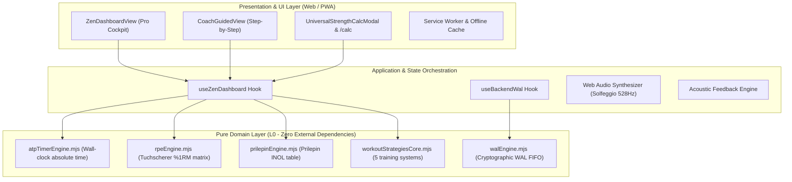

# ⚡ ATP-STRENGTH (NEURO//STRENGTH)
### Elite Neuromuscular Engineering, ATP-CP Phosphagen Resynthesis & Autonomous Power Platform

[](https://github.com/valentinflorezarbelaez-ai/ATP-STRENGTH/actions)
[](https://atp-strength.vercel.app/)
[-black?style=for-the-badge&logo=next.js)](https://nextjs.org/)
[](https://react.dev/)
[](https://www.typescriptlang.org/)
[](https://github.com/valentinflorezarbelaez-ai/ATP-STRENGTH)
[](docs/plans)
[](LICENSE)

---

## 🌐 Official Production Endpoints

| Service / Interface | Production URL | Primary Utility |
| :--- | :--- | :--- |
| 🚀 **Zen Temple (Primary App)** | **[atp-strength.vercel.app](https://atp-strength.vercel.app)** | Production dashboard, daily itineraries, ATP phosphagen timer, and set log. |
| ⚡ **Universal Strength Engine** | **[atp-strength.vercel.app/calc](https://atp-strength.vercel.app/calc)** | Full-screen agnostic neuromuscular calculator for barbells, dumbbells, and machines. |
| ⚔️ **Warrior Forge** | **[atp-strength.vercel.app/forge](https://atp-strength.vercel.app/forge)** | Classical strongman philosophy, foundational strength manifesto, and motivation. |

---

## 🏛️ Executive Summary

**ATP-STRENGTH** is a sports-science and software-engineering platform engineered for maximum human strength development, Olympic Rate of Force Development (RFD), and Central Nervous System (CNS) longevity.

Unlike conventional fitness applications that rely on simplistic linear percentages, ATP-STRENGTH implements formal bioenergetics models:
1. **Soviet INOL Table (A.S. Prilepin, 1974)** to monitor and prevent CNS overtraining in real time.
2. **Neuromuscular Autoregulation (Mike Tuchscherer / Reactive Training Systems)** to adapt loads based on set-by-set Rate of Perceived Exertion (RPE) and Reps in Reserve (RIR).
3. **Adenosine Triphosphate & Phosphocreatine (ATP-CP) Resynthesis Kinetics** to enforce scientifically optimal rest intervals (3–5 minutes) between maximal efforts.
4. **Local-First Write-Ahead Logging (WAL)** engine with cryptographic checksums (`djb2`) ensuring 100% offline autonomy in subterranean gym environments.

---

## 📐 Clean / Hexagonal System Architecture

The codebase adheres strictly to **Clean Architecture and L0 Domain Purity**:


```mermaid
graph TD
    subgraph UI_Presentation["Presentation & UI Layer (Web / PWA)"]
        UI_Zen["ZenDashboardView (Pro Cockpit)"]
        UI_Coach["CoachGuidedView (Step-by-Step)"]
        UI_Calc["UniversalStrengthCalcModal & /calc"]
        UI_PWA["Service Worker & Offline Cache"]
    end

    subgraph App_Orchestration["Application & State Orchestration"]
        H_Dash["useZenDashboard Hook"]
        H_WAL["useBackendWal Hook"]
        A_Audio["Web Audio Synthesizer (Solfeggio 528Hz)"]
        A_Voice["Acoustic Feedback Engine"]
    end

    subgraph Pure_Domain_L0["Pure Domain Layer (L0 - Zero External Dependencies)"]
        D_Timer["atpTimerEngine.mjs (Wall-clock absolute time)"]
        D_WAL["walEngine.mjs (Cryptographic WAL FIFO)"]
        D_RPE["rpeEngine.mjs (Tuchscherer %1RM matrix)"]
        D_Prilepin["prilepinEngine.mjs (Prilepin INOL table)"]
        D_Strat["workoutStrategiesCore.mjs (5 training systems)"]
    end

    UI_Zen --> H_Dash
    UI_Coach --> H_Dash
    UI_Calc --> H_Dash
    H_Dash --> D_Timer
    H_Dash --> D_RPE
    H_Dash --> D_Prilepin
    H_Dash --> D_Strat
    H_WAL --> D_WAL
```

* **L0 Domain Modules:** 100% pure ECMAScript with zero dependencies on `node_modules`, React, or the DOM.
* **Deterministic Contract:** Validated by 97 comprehensive unit tests executed directly via the native Node.js test runner.

---

## 🔬 Core Scientific Engines

### 1. Soviet Prilepin INOL Accumulation Engine
Calculates the accumulated neuromuscular stress using the classic Soviet formula:
$$\text{INOL} = \sum \frac{\text{Reps}}{100 - \%1\text{RM}}$$

| INOL Range | Physiological State | Engine Prescription |
| :--- | :--- | :--- |
| $< 0.40$ | Active Recovery / Warmup | Low neural stimulus; fresh CNS. |
| **$0.40 - 1.00$** | **Soviet Optimal Stimulus** | **Ideal strength & power adaptation zone.** |
| $1.00 - 1.20$ | High Neural Demand | Near fatigue threshold; enforce 4–5 min ATP rest. |
| $> 1.20$ | Overreaching / Central Fatigue | Engine advises concluding session to preserve CNS. |

### 2. Tuchscherer RPE/RIR Autoregulation Matrix
Re-evaluates the lifter's estimated 1-Rep Max (e1RM) and dynamically calculates the subsequent set load:
* **Fatigue Overshoot ($\ge +0.5$ RPE beyond target):** Automatically prescribes downward load adjustment (e.g., $-2.5$ to $-5.0$ kg) to prevent mechanical breakdown.
* **Supercompensation Undershoot ($\ge -0.5$ RPE below target):** Recalculates e1RM upward and suggests a calculated load increase.

### 3. Neuromuscular 3-1-X-1 Tempo Metronome
Paces execution cadence with visual and Web Audio acoustic clicks:
* **3s Eccentric:** Controlled elongation maximizing high-threshold motor unit recruitment.
* **1s Isometric Pause:** Dissipation of the stretch-shortening reflex at the bottom turnaround.
* **X Explosive Concentric:** 100% intent of Compensatory Acceleration Training (CAT).
* **1s Lockout:** Joint stabilization and intra-abdominal bracing reset.

### 4. IWF Olympic Barbell Visualizer
Renders precise plate distribution per barbell sleeve according to International Weightlifting Federation (IWF) standard color codes:
* **Red:** 25 kg | **Blue:** 20 kg | **Yellow:** 15 kg | **Green:** 10 kg | **White:** 5 kg | **Fractional:** 2.5 kg, 1.25 kg.
* Implements supported: Standard 20 kg barbell, 15 kg technique bar, 25 kg trap/hex bar, and 0 kg dumbbell/bodyweight.

---

## 🏋️ The 5 Master Training Systems

| Program ID | Name | Schedule | Primary Focus |
| :--- | :--- | :--- | :--- |
| `warrior` | **Forja del Guerrero** | 4 Active + 3 Rest | Functional strength, athletic resilience, compound movements. |
| `classic` | **Ciclo Clásico** | 4 Active + 2 Rest | Pure absolute strength & myofibrillar tension (Squat, Bench, Deadlift). |
| `olympic` | **Ciclo Olímpico** | 4 Active + 2 Rest | Rate of Force Development (RFD), triple extension, explosive clean/snatch. |
| `hybrid` | **Ciclo Híbrido** | 5 Active + 2 Rest | Concurrent strength + power for advanced hybrid athletes. |
| `universal-pr` | **Protocolo Universal (PR)** | Dynamic | Exercise-agnostic testing, calibration, and progressive overload. |

---

## 📱 Mobile-First Gym Ergonomics (PWA)

Built explicitly for real-world gym conditions (hands with sweat or chalk, bright/dim gym lighting, battery constraints):

* **Two-Tier Header Navigation:** Prominent, un-clippable `MODO PRO` / `MODO COACH` switcher alongside a smoothly swipeable utility chip bar.
* **Touch Targets $\ge 44 \times 44\text{px}$:** Large touch steppers (`-5 kg`, `-2.5 kg`, `+2.5 kg`, `+5 kg`), barbell selectors, and RPE pills.
* **Zero iOS Safari Input Zoom:** Enforces `font-size: 16px` on mobile inputs, preventing unwanted viewport reflows.
* **Anti-Lag Touch Latency:** `touch-action: manipulation` eliminates the 300ms mobile browser tap delay.
* **Dark Luxury True Black:** `#0c0d11` palette optimized for OLED power savings and zero eye strain.
* **Resilient Error Boundary:** Next.js `error.tsx` and `global-error.tsx` ensure that unhandled client anomalies present a styled Zen stabilization screen with one-tap session recovery rather than a blank screen.

---

## 🛠️ Local Development & Quality Gates

### Prerequisites
* **Node.js** $\ge 20.10.0$ (LTS recommended)
* **npm** $\ge 10.0.0$

### Setup & Execution
```bash
# 1. Clone repository
git clone https://github.com/valentinflorezarbelaez-ai/ATP-STRENGTH.git
cd ATP-STRENGTH/atp-strength-frontend

# 2. Install dependencies cleanly
npm ci

# 3. Execute 100% logic test suite (97 tests)
npm test

# 4. Start local development server
npm run dev

# 5. Compile production build with Turbopack & strict typechecking
npm run build
```

---

## 🛡️ Security, Privacy & Integrity

* **Zero Plain Secrets:** No API keys, credentials, or personal telemetry.
* **Offline-First Resilience:** Offline queue handles network disruptions gracefully; data commits upon verified HTTP status.
* **Cryptographic WAL Verification:** Ensures data stored on-device matches checksums before synchronization.

---

## 📄 License & Attribution

This project is licensed under the **MIT License** — see the [LICENSE](LICENSE) file for details.
Architected and developed with professional engineering discipline by [Valentin Florez Arbelaez](https://github.com/valentinflorezarbelaez-ai).
