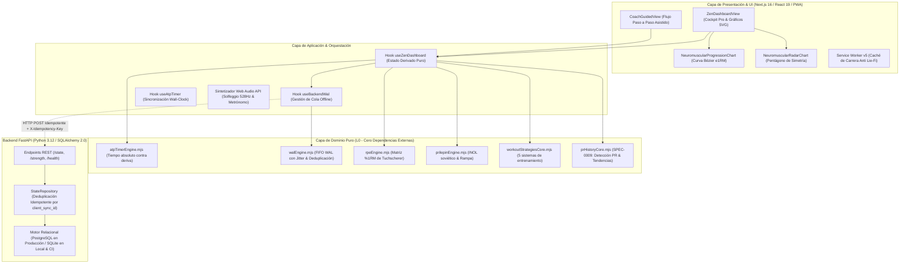

# ⚡ ATP-STRENGTH (NEURO//STRENGTH)
### Plataforma Industrial de Rendimiento Neuromuscular, Resíntesis de ATP-CP y Fuerza Máxima

[](https://github.com/valentinflorezarbelaez-ai/ATP-STRENGTH/actions)
[](https://atp-strength.vercel.app/)
[-black?style=for-the-badge&logo=next.js)](https://nextjs.org/)
[-3776AB?style=for-the-badge&logo=python)](https://fastapi.tiangolo.com/)
[](https://react.dev/)
[](https://www.typescriptlang.org/)
[](https://github.com/valentinflorezarbelaez-ai/ATP-STRENGTH)
[](https://github.com/valentinflorezarbelaez-ai/ATP-STRENGTH)
[](docker-compose.yml)
[](docs/plans)
[](LICENSE)

---

## 🌐 Enlaces Oficiales de la Plataforma

| Módulo / Servicio | Entorno Local | URL de Producción | Utilidad Principal |
| :--- | :--- | :--- | :--- |
| 🚀 **Templo Zen & Cockpit Pro** | `http://localhost:3000` | **[atp-strength.vercel.app](https://atp-strength.vercel.app)** | Dashboard de entrenamiento diario, itinerarios, cronómetro de ATP y registro de series. |
| ⚡ **Motor Universal de Fuerza** | `http://localhost:3000/calc` | **[atp-strength.vercel.app/calc](https://atp-strength.vercel.app/calc)** | Cabina universal de cálculo y fases neuromusculares adaptable a cualquier barra, mancuerna o máquina. |
| ⚔️ **La Forja de los Guerreros** | `http://localhost:3000/forge` | **[atp-strength.vercel.app/forge](https://atp-strength.vercel.app/forge)** | Manifiesto de fuerza real, principios clásicos, jukebox marcial y motivación pura. |
| 🔌 **API REST (Documentación Swagger)** | `http://127.0.0.1:8000/docs` | Render / Docker API | Especificación OpenAPI interactiva de telemetría, estados de sesión y máximos 1RM. |
| 🩺 **Endpoint de Salud (Healthcheck)** | `http://127.0.0.1:8000/health` | Backend Health | Sondeo automatizado de disponibilidad y conectividad del motor backend. |

---

## 🏛️ Resumen Ejecutivo

**ATP-STRENGTH** es una plataforma de ingeniería de software y ciencias del deporte diseñada para el desarrollo de la fuerza máxima humana, la potencia neuromuscular explosiva (RFD - *Rate of Force Development*) y la longevidad del Sistema Nervioso Central (SNC).

A diferencia de las aplicaciones convencionales de gimnasio que operan con progresiones porcentuales lineales simplistas y dependen de una conexión a internet ininterrumpida, ATP-STRENGTH implementa modelos bioenergéticos formales y una arquitectura *local-first* de máxima soberanía:

1. **Tabla de INOL Soviética (A.S. Prilepin, 1974)** para monitorear y prevenir el sobreentrenamiento del SNC en tiempo real.
2. **Autorregulación Neuromuscular (Mike Tuchscherer / Reactive Training Systems)** para ajustar las cargas serie a serie según la Escala de Esfuerzo Percibido (RPE) y las Repeticiones en Reserva (RIR).
3. **Cinética de Resíntesis de Trifosfato de Adenosina y Fosfocreatina (ATP-CP)** para garantizar descansos bioenergéticamente completos (3 a 5 minutos) entre esfuerzos submáximos y máximos.
4. **Curvas de Supercompensación Neuromuscular (SPEC-0009)** con trazado vectorial cúbico Bézier y detección automática de récords personales (PR).
5. **Motor Local-First con Diario de Transacciones (WAL)**, sumas de verificación criptográficas (`djb2`), backoff exponencial con *jitter* y deduplicación idempotente (`client_sync_id`).
6. **Defensa Activa Anti "Lie-Fi" (PWA v5)** que garantiza operatividad instantánea en sótanos y zonas con conectividad degradada.

---

## 📐 Arquitectura de Software Limpia / Hexagonal

El sistema respeta rigurosamente los principios de **Arquitectura Hexagonal y Pureza L0**:


```mermaid
graph TD
    subgraph Capa_Presentacion["Capa de Presentación & UI (Next.js 16 / React 19 / PWA)"]
        UI_Zen["ZenDashboardView (Cockpit Pro & Gráficos SVG)"]
        UI_Coach["CoachGuidedView (Flujo Paso a Paso Asistido)"]
        UI_Chart["NeuromuscularProgressionChart (Curva Bézier e1RM)"]
        UI_Radar["NeuromuscularRadarChart (Pentágono de Simetría)"]
        UI_SW["Service Worker v5 (Caché de Carrera Anti Lie-Fi)"]
    end

    subgraph Capa_Orquestacion["Capa de Aplicación & Orquestación"]
        H_Dash["Hook useZenDashboard (Estado Derivado Puro)"]
        H_WAL["Hook useBackendWal (Gestión de Cola Offline)"]
        H_Timer["Hook useAtpTimer (Sincronización Wall-Clock)"]
        A_Audio["Sintetizador Web Audio API (Solfeggio 528Hz & Metrónomo)"]
    end

    subgraph Dominio_Puro_L0["Capa de Dominio Puro (L0 - Cero Dependencias Externas)"]
        D_Timer["atpTimerEngine.mjs (Tiempo absoluto contra deriva)"]
        D_WAL["walEngine.mjs (FIFO WAL con Jitter & Deduplicación)"]
        D_RPE["rpeEngine.mjs (Matriz %1RM de Tuchscherer)"]
        D_Prilepin["prilepinEngine.mjs (INOL soviético & Rampa)"]
        D_Strat["workoutStrategiesCore.mjs (5 sistemas de entrenamiento)"]
        D_PR["prHistoryCore.mjs (SPEC-0009: Detección PR & Tendencias)"]
    end

    subgraph Backend_Hexagonal["Backend FastAPI (Python 3.12 / SQLAlchemy 2.0)"]
        B_Routes["Endpoints REST (/state, /strength, /health)"]
        B_Repo["StateRepository (Deduplicación Idempotente por client_sync_id)"]
        B_DB["Motor Relacional (PostgreSQL en Producción / SQLite en Local & CI)"]
    end

    UI_Zen --> H_Dash
    UI_Coach --> H_Dash
    UI_Zen --> UI_Chart
    UI_Zen --> UI_Radar
    H_Dash --> D_Timer
    H_Dash --> D_RPE
    H_Dash --> D_Prilepin
    H_Dash --> D_Strat
    H_Dash --> D_PR
    H_Dash --> H_WAL
    H_WAL --> D_WAL
    H_WAL -.->|HTTP POST Idempotente + X-Idempotency-Key| B_Routes
    B_Routes --> B_Repo
    B_Repo --> B_DB
```

* **Módulos de Dominio L0:** ECMAScript 100% puro sin dependencias de `node_modules`, React ni del DOM. Probables de forma aislada en microsegundos.
* **Idempotencia Garantizada:** Cada transacción genera un `client_sync_id` único inyectado en cabecera `X-Idempotency-Key`, evitando duplicación de series ante reintentos de red.
* **Cero Warnings:** Cumplimiento total de reglas estrictas de TypeScript (`tsc --noEmit`) y ESLint 9 (`eslint-config-next 16.3.8`).

---

## 🔬 Motores Científicos & Algoritmos Implementados

### 1. Motor de Acumulación INOL Soviético (Prilepin)
Evalúa el estrés neuromuscular acumulado en la sesión mediante la fórmula universal de la escuela soviética de halterofilia:
$$\text{INOL} = \sum \frac{\text{Repeticiones}}{100 - \%1\text{RM}}$$

| Rango de INOL | Estado Fisiológico | Prescripción del Motor |
| :--- | :--- | :--- |
| $< 0.40$ | Descarga / Calentamiento | Estímulo neural bajo; SNC completamente fresco. |
| **$0.40 - 1.00$** | **Óptimo Soviético** | **Zona reina de adaptación de fuerza y potencia sin fatiga residual.** |
| $1.00 - 1.20$ | Carga Alta (Límite Neural) | Cercano al umbral de fatiga; exige 4 a 5 min de descanso ATP. |
| $> 1.20$ | Sobrecarga Máxima del SNC | El motor recomienda finalizar la sesión para proteger la recuperación. |

### 2. Matriz de Autorregulación RPE/RIR (Mike Tuchscherer)
Recalcula el 1RM estimado (e1RM) del atleta y prescribe la carga de la siguiente serie en tiempo real:
* **Fatiga por Desvío Positivo ($\ge +0.5$ RPE de sobreesfuerzo):** Si la serie se sintió notablemente más pesada que la prescripción, prescribe un ajuste a la baja (ej. $-2.5$ a $-5.0$ kg) para evitar fallos técnicos.
* **Supercompensación ($\ge -0.5$ RPE de mayor velocidad):** Si la carga se movió con facilidad y reserva, recalcula el e1RM al alza y sugiere un incremento seguro.

### 3. Curva de Supercompensación Neuromuscular & PR (SPEC-0009)
* **Detección Automática de Récords:** Identifica nuevos picos de e1RM comparando contra el histórico consolidado del atleta.
* **Geometría Bézier Cúbica:** Trazado vectorial suave en SVG responsive (`viewBox="0 0 600 220"`) que grafica los picos de forma y las fases de supercompensación.
* **Clasificación de Tendencia:** Evalúa si el atleta se encuentra en estado de *Supercompensación*, *Adaptación Estable* o *Sobrecarga/Fatiga*.

### 4. Resistencia de Red Offline y Resincronización WAL
* **Gating Anti-Stampede:** Cuando se pierde la conexión, la cola WAL no satura la red; calcula intervalos con retroceso exponencial (*exponential backoff*) y fluctuación completa (*full jitter*) de hasta 30 segundos.
* **Detección de "Lie-Fi":** El Service Worker v5 ejecuta una carrera de 2500 ms contra la red; si la señal del gimnasio se congela, entrega la versión en caché instantáneamente sin bloquear la interfaz.

---

## 🏋️ Los 5 Sistemas Maestros de Entrenamiento

| Identificador | Programa | Estructura | Enfoque Primario |
| :--- | :--- | :--- | :--- |
| `warrior` | **Forja del Guerrero** | 4 Activos + 3 Descanso | Fuerza funcional, resiliencia atlética y movimientos compuestos. |
| `classic` | **Ciclo Clásico** | 4 Activos + 2 Descanso | Fuerza pura absoluta y tensión miofibrilar (Sentadilla, Banca, Peso Muerto). |
| `olympic` | **Ciclo Olímpico** | 4 Activos + 2 Descanso | Tasa de desarrollo de fuerza (RFD), triple extensión y levantamientos balísticos. |
| `hybrid` | **Ciclo Híbrido** | 5 Activos + 2 Descanso | Hipertrofia sarcomérica y potencia para atletas híbridos avanzados. |
| `universal-pr` | **Protocolo Universal (PR)** | Dinámico / Cualquier Ejercicio | Calibración, testeo seguro y progresión escalonada en cualquier levantamiento o máquina. |

---

## 🧪 Jerarquía de Pruebas & Calidad (130 Tests Verificados)

La plataforma cuenta con una triple barrera determinista de aseguramiento de calidad:

| Capa de Prueba | Tecnología | Cobertura / Alcance | Cantidad |
| :--- | :--- | :--- | :--- |
| **Dominio & Lógica L0** | Node Native Test Runner | Cronómetro, WAL, Prilepin, RPE, 5 Programas, Historial de PRs | **111 tests** |
| **Navegador End-to-End (E2E)** | Playwright (Chromium) | Shell PWA, Service Worker v5, WAL offline, Curva Bézier SVG | **11 tests** |
| **Backend & Arquitectura** | Pytest + TestClient | Rutas REST, Persistencia SQLite/PostgreSQL, Aislamiento Hexagonal | **8 tests** |
| **Total Automatizado** | — | **Verificación continua con 100% de éxito** | **130 tests** |

### Ejecución de Pruebas Locales

```bash
# 1. Tests de Dominio y Lógica Frontend (111 tests)
cd atp-strength-frontend && npm test

# 2. Tests de Navegador End-to-End con Playwright (11 tests)
npm run test:e2e

# 3. Linter y Tipado Estricto (0 warnings)
npm run lint && npx tsc --noEmit

# 4. Tests del Backend en Python (8 tests)
cd ../atp-strength-backend && pytest tests/ -v

# 5. Linter y Formato del Backend (Ruff)
python -m ruff check . && python -m ruff format --check .
```

---

## 🚀 Despliegue con Docker Compose (Contenedorización Total)

Para levantar la plataforma completa de forma determinista (backend FastAPI + frontend Next.js) en un solo comando:

```bash
# Construir y levantar servicios en segundo plano
docker compose up --build -d

# Verificación de logs
docker compose logs -f

# Detener los servicios
docker compose down
```

* **Frontend:** Disponible en `http://localhost:3000`
* **Backend:** Disponible en `http://localhost:8000`

---

## 🛡️ Seguridad, Privacidad y Soberanía del Atleta

* **0 Vulnerabilidades:** Dependencias auditadas contra avisos de seguridad (`npm audit` reporta 0 vulnerabilidades; Next.js blindado en `16.3.8`).
* **Soberanía de Datos:** Tus marcas no están atrapadas en una nube propietaria. El sistema incluye exportación/importación criptográfica completa en formato **JSON** y **CSV** con un solo clic.
* **Cero Telemetría Invasiva:** Sin rastreadores comerciales de terceros, sin cookies espía y sin recolección de datos personales.

---

## 📄 Licencia

Este proyecto se distribuye bajo la **Licencia MIT** — consultar el archivo [LICENSE](LICENSE) para más detalles.

Arquitecturado y desarrollado con disciplina de ingeniería por **[Valentín Flórez Arbeláez](https://github.com/valentinflorezarbelaez-ai)**.
