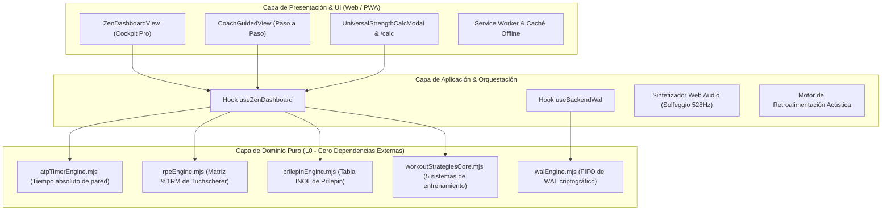

# ⚡ ATP-STRENGTH (NEURO//STRENGTH)
### Plataforma de Rendimiento Neuromuscular, Resíntesis de ATP-CP y Fuerza Máxima

[](https://github.com/valentinflorezarbelaez-ai/ATP-STRENGTH/actions)
[](https://atp-strength.vercel.app/)
[-black?style=for-the-badge&logo=next.js)](https://nextjs.org/)
[](https://react.dev/)
[](https://www.typescriptlang.org/)
[](https://github.com/valentinflorezarbelaez-ai/ATP-STRENGTH)
[](docs/plans)
[](LICENSE)

---

## 🌐 Enlaces Oficiales de Producción

| Módulo / Interfaz | URL de Producción | Utilidad Principal |
| :--- | :--- | :--- |
| 🚀 **Templo Zen (App Principal)** | **[atp-strength.vercel.app](https://atp-strength.vercel.app)** | Dashboard de entrenamiento diario, itinerarios, cronómetro de ATP y registro de series. |
| ⚡ **Motor Universal de Fuerza** | **[atp-strength.vercel.app/calc](https://atp-strength.vercel.app/calc)** | Cabina universal de cálculo y fases neuromusculares adaptable a cualquier barra, mancuerna o máquina. |
| ⚔️ **La Forja de Guerreros** | **[atp-strength.vercel.app/forge](https://atp-strength.vercel.app/forge)** | Manifiesto de fuerza real, principios de los strongman clásicos y motivación pura. |

---

## 🏛️ Resumen Ejecutivo

**ATP-STRENGTH** es una plataforma de ingeniería de software y ciencias del deporte diseñada para el desarrollo de la fuerza máxima humana, la potencia neuromuscular explosiva (RFD - *Rate of Force Development*) y la longevidad del Sistema Nervioso Central (SNC).

A diferencia de las aplicaciones convencionales de gimnasio que operan con progresiones porcentuales lineales simplistas, ATP-STRENGTH implementa modelos bioenergéticos formales:
1. **Tabla de INOL Soviética (A.S. Prilepin, 1974)** para monitorear y prevenir el sobreentrenamiento del SNC en tiempo real.
2. **Autorregulación Neuromuscular (Mike Tuchscherer / Reactive Training Systems)** para ajustar las cargas serie a serie según la Escala de Esfuerzo Percibido (RPE) y las Repeticiones en Reserva (RIR).
3. **Cinética de Resíntesis de Trifosfato de Adenosina y Fosfocreatina (ATP-CP)** para garantizar descansos bioenergéticamente completos (3 a 5 minutos) entre esfuerzos submáximos y máximos.
4. **Motor Local-First con Diario de Transacciones (WAL)** y sumas de verificación criptográficas (`djb2`) que aseguran autonomía total sin conexión a internet en gimnasios subterráneos.

---

## 📐 Arquitectura de Software Limpia / Hexagonal

El sistema respeta rigurosamente los principios de **Arquitectura Hexagonal y Pureza L0**:


```mermaid
graph TD
    subgraph Capa_Presentacion["Capa de Presentación & UI (Web / PWA)"]
        UI_Zen["ZenDashboardView (Cockpit Pro)"]
        UI_Coach["CoachGuidedView (Paso a Paso)"]
        UI_Calc["UniversalStrengthCalcModal & /calc"]
        UI_PWA["Service Worker & Caché Offline"]
    end

    subgraph Capa_Orquestacion["Capa de Aplicación & Orquestación"]
        H_Dash["Hook useZenDashboard"]
        H_WAL["Hook useBackendWal"]
        A_Audio["Sintetizador Web Audio (Solfeggio 528Hz)"]
        A_Voice["Motor de Retroalimentación Acústica"]
    end

    subgraph Dominio_Puro_L0["Capa de Dominio Puro (L0 - Cero Dependencias Externas)"]
        D_Timer["atpTimerEngine.mjs (Tiempo absoluto de pared)"]
        D_WAL["walEngine.mjs (FIFO de WAL criptográfico)"]
        D_RPE["rpeEngine.mjs (Matriz %1RM de Tuchscherer)"]
        D_Prilepin["prilepinEngine.mjs (Tabla INOL de Prilepin)"]
        D_Strat["workoutStrategiesCore.mjs (5 sistemas de entrenamiento)"]
    end

    UI_Zen --> H_Dash
    UI_Coach --> H_Dash
    UI_Calc --> H_Dash
    H_Dash --> D_Timer
    H_Dash --> D_RPE
    H_Dash --> D_Prilepin
    H_Dash --> D_Strat
    H_WAL --> D_WAL
```

* **Módulos de Dominio L0:** ECMAScript 100% puro sin dependencias de `node_modules`, React ni del DOM.
* **Contrato Determinista:** 97 pruebas unitarias ejecutadas directamente mediante el ejecutor de pruebas nativo de Node.js (`node --test`).

---

## 🔬 Motores Científicos Integrados

### 1. Motor de Acumulación INOL Soviético (Prilepin)
Evalúa el estrés neuromuscular acumulado en la sesión mediante la fórmula universal de la escuela soviética de halterofilia:
$$\text{INOL} = \sum \frac{\text{Repeticiones}}{100 - \%1\text{RM}}$$

| Rango de INOL | Estado Fisiológico | Prescripción del Motor |
| :--- | :--- | :--- |
| $< 0.40$ | Descarga / Calentamiento | Estímulo neural bajo; SNC completamente fresco. |
| **$0.40 - 1.00$** | **Óptimo Soviético** | **Zona reina de adaptación de fuerza y potencia sin fatiga residual.** |
| $1.00 - 1.20$ | Carga Alta (Límite Neural) | Cercano al umbral de fatiga; exige 4 a 5 min de descanso ATP. |
| $> 1.20$ | Sobrecarga Máxima del SNC | El motor recomienda finalizar la sesión para proteger la recuperación. |

### 2. Matriz de Autorregulación RPE/RIR (Mike Tuchscherer)
Recalcula el 1RM estimado (e1RM) del atleta y prescribe la carga de la siguiente serie en tiempo real:
* **Fatiga por Desvío Positivo ($\ge +0.5$ RPE de sobreesfuerzo):** Si la serie se sintió notablemente más pesada que la prescripción, prescribe un ajuste a la baja (ej. $-2.5$ a $-5.0$ kg) para evitar fallos técnicos.
* **Supercompensación ($\ge -0.5$ RPE de mayor velocidad):** Si la carga se movió con facilidad y reserva, recalcula el e1RM al alza y sugiere un incremento seguro.

### 3. Metrónomo de Tempo Neuromuscular 3-1-X-1
Sincroniza la cadencia de ejecución mediante pulsos visuales y clics acústicos con la Web Audio API:
* **3 Segundos Excéntrica:** Descenso hipercontrolado para reclutar unidades motoras de alto umbral.
* **1 Segundo Pausa Isométrica:** Disipación del reflejo miotático elástico en el punto de estiramiento.
* **X Explosión Concéntrica:** Máxima intención de aceleración compensatoria (CAT - *Compensatory Acceleration Training*).
* **1 Segundo Bloqueo:** Estabilización articular y reseteo de la presión intraabdominal (IAP).

### 4. Visualizador Olímpico de Carga en Barra (IWF)
Calcula y representa gráficamente la distribución exacta de discos por manga según el código cromático oficial de la Federación Internacional de Halterofilia (IWF):
* **Rojo:** 25 kg | **Azul:** 20 kg | **Amarillo:** 15 kg | **Verde:** 10 kg | **Blanco:** 5 kg | **Microdiscos:** 2.5 kg, 1.25 kg.
* Implementos calibrados: Barra estándar de 20 kg, barra olímpica técnica de 15 kg, barra hexagonal/trap bar de 25 kg y opción de 0 kg para mancuernas o lastre corporal.

---

## 🏋️ Los 5 Sistemas Maestros de Entrenamiento

| Identificador | Programa | Estructura | Enfoque Primario |
| :--- | :--- | :--- | :--- |
| `warrior` | **Forja del Guerrero** | 4 Activos + 3 Descanso | Fuerza funcional, resiliencia atlética y movimientos compuestos. |
| `classic` | **Ciclo Clásico** | 4 Activos + 2 Descanso | Fuerza pura absoluta y tensión miofibrilar (Sentadilla, Banca, Peso Muerto). |
| `olympic` | **Ciclo Olímpico** | 4 Activos + 2 Descanso | Tasa de desarrollo de fuerza (RFD), triple extensión y levantamientos balísticos. |
| `hybrid` | **Ciclo Híbrido** | 5 Activos + 2 Descanso | Hipertrofia sarcomérica y potencia para atletas híbridos avanzados. |
| `universal-pr` | **Protocolo Universal (PR)** | Dinámico / Cualquier Ejercicio | Calibración, testeo seguro y progresión escalonada en cualquier levantamiento o máquina. |

---

## 📱 Ergonomía Móvil Gym-First (PWA)

Diseñado específicamente para las condiciones reales de un entrenamiento pesado en el gimnasio:

* **Cabecera de 2 Niveles:** Botón destacado e imposible de cortar para alternar entre **`MODO PRO`** y **`MODO COACH`**, junto a una barra deslizable de herramientas útiles.
* **Touch Targets Amplios ($\ge 44 \times 44\text{px}$):** Steppers táctiles rápidos (`-5 kg`, `-2.5 kg`, `+2.5 kg`, `+5 kg`), selectores de barra y píldoras de RPE fáciles de tocar con tiza o sudor en las manos.
* **Bloqueo de Zoom en iOS:** Control estricto de `font-size: 16px` en inputs móviles para evitar que Safari haga zoom automático y desplace la vista al editar pesos.
* **Cero Latencia Táctil:** Inyección de `touch-action: manipulation` para suprimir el retraso de 300 ms en navegadores móviles.
* **True Black OLED:** Paleta `#0c0d11` de alto contraste, ahorro de batería y descanso visual.
* **Escudo de Resiliencia ante Errores:** Pantallas de error dedicadas (`error.tsx` y `global-error.tsx`) que evitan pantallas blancas y ofrecen recuperación de sesión con un solo toque preservando los datos del WAL.

---

## 🛠️ Desarrollo Local & Verificación Técnica

### Requisitos Previos
* **Node.js** $\ge 20.10.0$ (LTS recomendado)
* **npm** $\ge 10.0.0$

### Instalación y Ejecución
```bash
# 1. Clonar el repositorio
git clone https://github.com/valentinflorezarbelaez-ai/ATP-STRENGTH.git
cd ATP-STRENGTH/atp-strength-frontend

# 2. Instalación limpia de dependencias
npm ci

# 3. Ejecutar la suite completa de pruebas unitarias (97 tests)
npm test

# 4. Iniciar el servidor local de desarrollo
npm run dev

# 5. Compilar el paquete de producción (Turbopack + TypeScript estricto)
npm run build
```

---

## 🛡️ Seguridad, Privacidad e Integridad

* **Cero Telemetría & Cero Secretos Expuestos:** Sin rastreadores de terceros, sin cookies invasivas y sin claves privadas en el código fuente.
* **Autonomía Offline Completa:** El almacenamiento persistente almacena los registros localmente y los sincroniza de forma segura al detectar conectividad.
* **Verificación de Integridad WAL:** Cada serie se valida criptográficamente con sumas de comprobación antes de ser procesada.

---

## 📄 Licencia & Créditos

Este proyecto se distribuye bajo la **Licencia MIT** — consultar el archivo [LICENSE](LICENSE) para más detalles.

Arquitecturado y desarrollado con disciplina de ingeniería por [Valentín Flórez Arbeláez](https://github.com/valentinflorezarbelaez-ai).
