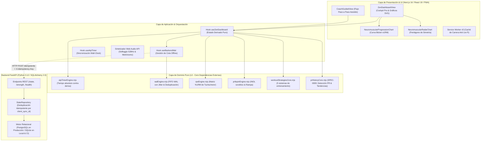

Este es el README para reemplazar el archivo entero. La sesión de abajo es la que está en https://atp-strength.vercel.app. El resto es el documento que mandaste, con la puerta, el PR, la voz y el himno puestos al día.

````markdown
# ⚡ ATP-STRENGTH (NEURO//STRENGTH)
### Plataforma Industrial de Rendimiento Neuromuscular, Resíntesis de ATP-CP y Fuerza Máxima

[](https://github.com/valentinflorezarbelaez-ai/ATP-STRENGTH/actions)
[](https://atp-strength.vercel.app/)
[-black?style=for-the-badge&logo=next.js)](https://nextjs.org/)
[-3776AB?style=for-the-badge&logo=python)](https://fastapi.tiangolo.com/)
[](https://react.dev/)
[](https://www.typescriptlang.org/)
[](https://github.com/valentinflorezarbelaez-ai/ATP-STRENGTH)
[](https://github.com/valentinflorezarbelaez-ai/ATP-STRENGTH)
[](docker-compose.yml)
[](docs/plans)
[](LICENSE)

---

## 🌐 Enlaces Oficiales de la Plataforma

| Módulo / Servicio | Entorno Local | URL de Producción | Utilidad Principal |
| :--- | :--- | :--- | :--- |
| 🚀 **Templo Zen & Cockpit Pro** | `http://localhost:3000` | **[atp-strength.vercel.app](https://atp-strength.vercel.app)** | Sesión de fuerza: ejercicio, PR, fases al 90 % y reloj de descanso. Las marcas quedan en el dispositivo. |
| ⚡ **Motor Universal de Fuerza** | `http://localhost:3000/calc` | **[atp-strength.vercel.app/calc](https://atp-strength.vercel.app/calc)** | Calculadora de fases. «Volver a la sesión» permanece visible y el descanso corre en esa pantalla. |
| ⚔️ **La Forja de los Guerreros** | `http://localhost:3000/forge` | **[atp-strength.vercel.app/forge](https://atp-strength.vercel.app/forge)** | Puerta de la sesión. El himno permanece en silencio hasta «Poner el himno». |
| 🔌 **API REST (Documentación Swagger)** | `http://127.0.0.1:8000/docs` | Render / Docker API | Especificación OpenAPI interactiva de telemetría, estados de sesión y máximos 1RM. |
| 🩺 **Endpoint de Salud (Healthcheck)** | `http://127.0.0.1:8000/health` | Backend Health | Sondeo automatizado de disponibilidad y conectividad del motor backend. |

---

## 🏛️ Resumen Ejecutivo

**ATP-STRENGTH** es una plataforma de ingeniería de software y ciencias del deporte diseñada para el desarrollo de la fuerza máxima humana, la potencia neuromuscular explosiva (RFD - *Rate of Force Development*) y la longevidad del Sistema Nervioso Central (SNC).

A diferencia de las aplicaciones convencionales de gimnasio que operan con progresiones porcentuales lineales simplistas y dependen de una conexión a internet ininterrumpida, ATP-STRENGTH implementa modelos bioenergéticos formales y una arquitectura *local-first* de máxima soberanía:

1. **Tabla de INOL Soviética (A.S. Prilepin, 1974)** para monitorear y prevenir el sobreentrenamiento del SNC en tiempo real.
2. **Autorregulación Neuromuscular (Mike Tuchscherer / Reactive Training Systems)** para ajustar las cargas serie a serie según la Escala de Esfuerzo Percibido (RPE) y las Repeticiones en Reserva (RIR).
3. **Cinética de Resíntesis de Trifosfato de Adenosina y Fosfocreatina (ATP-CP)** para garantizar descansos bioenergéticamente completos (3 a 5 minutos) entre esfuerzos submáximos y máximos.
4. **Curvas de Supercompensación Neuromuscular (SPEC-0009)** con trazado vectorial cúbico Bézier y detección automática de récords personales (PR).
5. **Motor Local-First con Diario de Transacciones (WAL)**, sumas de verificación criptográficas (`djb2`), backoff exponencial con *jitter* y deduplicación idempotente (`client_sync_id`).
6. **Defensa Activa Anti "Lie-Fi" (PWA v5)** que garantiza operatividad instantánea en sótanos y zonas con conectividad degradada.

La sesión en producción pide cualquier ejercicio y su PR, estima el PR si hace falta, y trabaja las fases al 90 % de ese número. El oro queda en la acción principal. El himno y la voz no hablan ni suenan hasta que la persona lo pide.

---

## 🏋️ Sesión en producción

Sitio: [https://atp-strength.vercel.app](https://atp-strength.vercel.app)

1. **Puerta.** La forja abre la sesión. El himno permanece en silencio, y el archivo no se pide, hasta «Poner el himno». Sobre «ENTRAR AL TEMPLO» está la línea: «El estándar son los más fuertes que vivieron: Eddie Hall, Brian Shaw, Žydrūnas Savickas, Hafþór Björnsson, Mark Felix, Louis Cyr y los demás.»

2. **Ejercicio y PR.** La pantalla dice «Ingresa el ejercicio que vas a realizar y tu PR.» Debajo repite la misma línea. El nombre se escribe: no está limitado al catálogo. Si ese ejercicio ya tiene un PR guardado, aparece «Ya tenés un PR de {n} kg en este dispositivo. Podés cambiarlo.»

3. **Ayuda para el PR.** «Ayudar a sacar el PR» pide un peso y unas repeticiones. «Poner este PR» estima el número con la fórmula del código (`computeOneRm`, Epley por defecto): peso × (1 + repeticiones / 30), redondeado a un decimal. Con una repetición, el resultado es el peso, también a un decimal.

4. **Fases.** «Confirmar» guarda ese número en el dispositivo como el PR de la sesión, sin volver a estimarlo. Las fases trabajan al 90 % de ese PR. Lo primero después de confirmar son las series. La fase 4 está marcada como «Esta es la serie fuerte.»

5. **Descanso.** Cada serie abre un solo reloj, «Descanso», y oculta las series mientras está en pantalla. Los controles son «Listo», «Pausar» o «Seguir», y «+30 s». Al pausar, el reloj sigue visible. Coach, pro y `/calc` comparten ese reloj.

6. **Voz.** En las series hay un solo control: «Voz» o «Voz en silencio». En el perfil, «Voz del coach» es el mismo ajuste y muestra «Activada» o «Silencio».

7. **Progreso.** Si el servidor no se puede leer, la pantalla dice «No se pudieron leer las marcas.» Si además hay marcas en el dispositivo, dice «No se pudieron leer las marcas. Estas son las de este dispositivo.» Esa falla no se presenta como si no hubiera marcas.

8. **Color.** El oro queda en «ENTRAR AL TEMPLO», «Confirmar» y «Listo». Los demás controles de ese recorrido van en zinc. El modo pro usa el título «Sesión de fuerza».

En la sesión, los controles que se tocan miden al menos 44 px y tienen nombre. «Ir a la forja» solo abre la forja. La guía se cierra con «Cerrar guía» o con Escape.

---

## 📐 Arquitectura de Software Limpia / Hexagonal

El sistema respeta rigurosamente los principios de **Arquitectura Hexagonal y Pureza L0**:


```mermaid
graph TD
    subgraph Capa_Presentacion["Capa de Presentación & UI (Next.js 16 / React 19 / PWA)"]
        UI_Zen["ZenDashboardView (Cockpit Pro & Gráficos SVG)"]
        UI_Coach["CoachGuidedView (Flujo Paso a Paso Asistido)"]
        UI_Chart["NeuromuscularProgressionChart (Curva Bézier e1RM)"]
        UI_Radar["NeuromuscularRadarChart (Pentágono de Simetría)"]
        UI_SW["Service Worker v5 (Caché de Carrera Anti Lie-Fi)"]
    end

    subgraph Capa_Orquestacion["Capa de Aplicación & Orquestación"]
        H_Dash["Hook useZenDashboard (Estado Derivado Puro)"]
        H_WAL["Hook useBackendWal (Gestión de Cola Offline)"]
        H_Timer["Hook useAtpTimer (Sincronización Wall-Clock)"]
        A_Audio["Sintetizador Web Audio API (Solfeggio 528Hz & Metrónomo)"]
    end

    subgraph Dominio_Puro_L0["Capa de Dominio Puro (L0 - Cero Dependencias Externas)"]
        D_Timer["atpTimerEngine.mjs (Tiempo absoluto contra deriva)"]
        D_WAL["walEngine.mjs (FIFO WAL con Jitter & Deduplicación)"]
        D_RPE["rpeEngine.mjs (Matriz %1RM de Tuchscherer)"]
        D_Prilepin["prilepinEngine.mjs (INOL soviético & Rampa)"]
        D_Strat["workoutStrategiesCore.mjs (5 sistemas de entrenamiento)"]
        D_PR["prHistoryCore.mjs (SPEC-0009: Detección PR & Tendencias)"]
    end

    subgraph Backend_Hexagonal["Backend FastAPI (Python 3.12 / SQLAlchemy 2.0)"]
        B_Routes["Endpoints REST (/state, /strength, /health)"]
        B_Repo["StateRepository (Deduplicación Idempotente por client_sync_id)"]
        B_DB["Motor Relacional (PostgreSQL en Producción / SQLite en Local & CI)"]
    end

    UI_Zen --> H_Dash
    UI_Coach --> H_Dash
    UI_Zen --> UI_Chart
    UI_Zen --> UI_Radar
    H_Dash --> D_Timer
    H_Dash --> D_RPE
    H_Dash --> D_Prilepin
    H_Dash --> D_Strat
    H_Dash --> D_PR
    H_Dash --> H_WAL
    H_WAL --> D_WAL
    H_WAL -.->|HTTP POST Idempotente + X-Idempotency-Key| B_Routes
    B_Routes --> B_Repo
    B_Repo --> B_DB
```

* **Módulos de Dominio L0:** ECMAScript 100% puro sin dependencias de `node_modules`, React ni del DOM. Probables de forma aislada en microsegundos.
* **Idempotencia Garantizada:** Cada transacción genera un `client_sync_id` único inyectado en cabecera `X-Idempotency-Key`, evitando duplicación de series ante reintentos de red.
* **Cero Warnings:** Cumplimiento total de reglas estrictas de TypeScript (`tsc --noEmit`) y ESLint 9 (`eslint-config-next 16.3.8`). El lint del frontend en la sesión actual termina sin errores ni avisos.

---

## 🔬 Motores Científicos & Algoritmos Implementados

### 1. Motor de Acumulación INOL Soviético (Prilepin)
Evalúa el estrés neuromuscular acumulado en la sesión mediante la fórmula universal de la escuela soviética de halterofilia:
$$\text{INOL} = \sum \frac{\text{Repeticiones}}{100 - \%1\text{RM}}$$

| Rango de INOL | Estado Fisiológico | Prescripción del Motor |
| :--- | :--- | :--- |
| $< 0.40$ | Descarga / Calentamiento | Estímulo neural bajo; SNC completamente fresco. |
| **$0.40 - 1.00$** | **Óptimo Soviético** | **Zona reina de adaptación de fuerza y potencia sin fatiga residual.** |
| $1.00 - 1.20$ | Carga Alta (Límite Neural) | Cercano al umbral de fatiga; exige 4 a 5 min de descanso ATP. |
| $> 1.20$ | Sobrecarga Máxima del SNC | El motor recomienda finalizar la sesión para proteger la recuperación. |

### 2. Matriz de Autorregulación RPE/RIR (Mike Tuchscherer)
Recalcula el 1RM estimado (e1RM) del atleta y prescribe la carga de la siguiente serie en tiempo real:
* **Fatiga por Desvío Positivo ($\ge +0.5$ RPE de sobreesfuerzo):** Si la serie se sintió notablemente más pesada que la prescripción, prescribe un ajuste a la baja (ej. $-2.5$ a $-5.0$ kg) para evitar fallos técnicos.
* **Supercompensación ($\ge -0.5$ RPE de mayor velocidad):** Si la carga se movió con facilidad y reserva, recalcula el e1RM al alza y sugiere un incremento seguro.

### 3. Curva de Supercompensación Neuromuscular & PR (SPEC-0009)
* **Detección Automática de Récords:** Identifica nuevos picos de e1RM comparando contra el histórico consolidado del atleta.
* **Geometría Bézier Cúbica:** Trazado vectorial suave en SVG responsive (`viewBox="0 0 600 220"`) que grafica los picos de forma y las fases de supercompensación.
* **Clasificación de Tendencia:** Evalúa si el atleta se encuentra en estado de *Supercompensación*, *Adaptación Estable* o *Sobrecarga/Fatiga*.
* **Entrada de la sesión:** el PR con el que abren las fases es el número que la persona confirma. La ayuda usa Epley, peso × (1 + repeticiones / 30), a un decimal. Una repetición deja el peso, también a un decimal.

### 4. Resistencia de Red Offline y Resincronización WAL
* **Gating Anti-Stampede:** Cuando se pierde la conexión, la cola WAL no satura la red; calcula intervalos con retroceso exponencial (*exponential backoff*) y fluctuación completa (*full jitter*) de hasta 30 segundos.
* **Detección de "Lie-Fi":** El Service Worker v5 ejecuta una carrera de 2500 ms contra la red; si la señal del gimnasio se congela, entrega la versión en caché instantáneamente sin bloquear la interfaz.
* **Lectura de historial:** si `https://atp-strength-backend.onrender.com` no responde, Progreso lo dice en una frase y muestra las marcas de este dispositivo. No las presenta como un historial vacío.

---

## 🏋️ Los 5 Sistemas Maestros de Entrenamiento

| Identificador | Programa | Estructura | Enfoque Primario |
| :--- | :--- | :--- | :--- |
| `warrior` | **Forja del Guerrero** | 4 Activos + 3 Descanso | Fuerza funcional, resiliencia atlética y movimientos compuestos. |
| `classic` | **Ciclo Clásico** | 4 Activos + 2 Descanso | Fuerza pura absoluta y tensión miofibrilar (Sentadilla, Banca, Peso Muerto). |
| `olympic` | **Ciclo Olímpico** | 4 Activos + 2 Descanso | Tasa de desarrollo de fuerza (RFD), triple extensión y levantamientos balísticos. |
| `hybrid` | **Ciclo Híbrido** | 5 Activos + 2 Descanso | Hipertrofia sarcomérica y potencia para atletas híbridos avanzados. |
| `universal-pr` | **Protocolo Universal (PR)** | Dinámico / Cualquier Ejercicio | Cualquier ejercicio escrito por la persona, con su PR, al 90 % en las fases. |

---

## 🧪 Jerarquía de Pruebas & Calidad (130 Tests Verificados)

La plataforma cuenta con una triple barrera determinista de aseguramiento de calidad:

| Capa de Prueba | Tecnología | Cobertura / Alcance | Cantidad |
| :--- | :--- | :--- | :--- |
| **Dominio & Lógica L0** | Node Native Test Runner | Cronómetro, WAL, Prilepin, RPE, 5 Programas, Historial de PRs | **111 tests** |
| **Navegador End-to-End (E2E)** | Playwright (Chromium) | Shell PWA, Service Worker v5, WAL offline, Curva Bézier SVG | **11 tests** |
| **Backend & Arquitectura** | Pytest + TestClient | Rutas REST, Persistencia SQLite/PostgreSQL, Aislamiento Hexagonal | **8 tests** |
| **Total Automatizado** | — | **Verificación continua con 100% de éxito** | **130 tests** |

### Ejecución de Pruebas Locales

```bash
# 1. Tests de Dominio y Lógica Frontend (111 tests)
cd atp-strength-frontend && npm test

# 2. Tests de Navegador End-to-End con Playwright (11 tests)
npm run test:e2e

# 3. Linter y Tipado Estricto (0 warnings)
npm run lint && npx tsc --noEmit

# 4. Tests del Backend en Python (8 tests)
cd ../atp-strength-backend && pytest tests/ -v

# 5. Linter y Formato del Backend (Ruff)
python -m ruff check . && python -m ruff format --check .
```

### Frontend en local

Hace falta Node.js. Desde la raíz del repositorio:

```bash
cd atp-strength-frontend
npm install
npm run dev
```

La app queda en [http://localhost:3000](http://localhost:3000).

```bash
npm run lint
npm run build
```

`npm run lint` tiene que terminar sin errores ni avisos. `npm run build` compila con Turbopack.

Sin `NEXT_PUBLIC_API_URL`, el cliente intenta `http://localhost:8000`. Si ese servidor no responde, la sesión igual funciona con las marcas de este dispositivo.

---

## 🚀 Despliegue con Docker Compose (Contenedorización Total)

Para levantar la plataforma completa de forma determinista (backend FastAPI + frontend Next.js) en un solo comando:

```bash
# Construir y levantar servicios en segundo plano
docker compose up --build -d

# Verificación de logs
docker compose logs -f

# Detener los servicios
docker compose down
```

* **Frontend:** Disponible en `http://localhost:3000`
* **Backend:** Disponible en `http://localhost:8000`
* **Producción del frontend:** [https://atp-strength.vercel.app](https://atp-strength.vercel.app), proyecto Vercel `atp-strength`.

---

## 🛡️ Seguridad, Privacidad y Soberanía del Atleta

* **0 Vulnerabilidades:** Dependencias auditadas contra avisos de seguridad (`npm audit` reporta 0 vulnerabilidades; Next.js blindado en `16.3.8`).
* **Soberanía de Datos:** Las marcas de la sesión se guardan en el dispositivo. En el perfil, el bloque se llama «Copias en este dispositivo» y la exportación sigue disponible en **JSON** y **CSV**.
* **Cero Telemetría Invasiva:** Sin rastreadores comerciales de terceros, sin cookies espía y sin recolección de datos personales. La sesión no registra el PR en la consola para calcularlo.

---

## 🚀 Registro de Actualizaciones & Hitos de Ingeniería (Edición Perfección Total)

| Hito | Módulo / Commit | Descripción de la Mejora | Impacto Técnico |
| :--- | :--- | :--- | :--- |
| **01** | `refactor(quality)` [`acd8550`](https://github.com/valentinflorezarbelaez-ai/ATP-STRENGTH/commit/acd8550) | Saneamiento de 93 variables y eliminación de `setState` síncrono en `useEffect`. | 0 errores y 0 warnings en ESLint y TypeScript. |
| **02** | `feat(pwa)` [`cdd3d8a`](https://github.com/valentinflorezarbelaez-ai/ATP-STRENGTH/commit/cdd3d8a) | Service Worker v5 (`neuro-strength-v5`) con carrera de 2500ms (`fetchWithTimeout`). | Operatividad instantánea frente a condiciones de "Lie-Fi" en sótanos. |
| **03** | `feat(history)` [`46f63a0`](https://github.com/valentinflorezarbelaez-ai/ATP-STRENGTH/commit/46f63a0) | Motor L0 puro en `prHistoryCore.mjs` y gráfico SVG de supercompensación (SPEC-0009). | Trazado vectorial Bézier cúbico de e1RM y detección automática de PRs. |
| **04** | `feat(sync)` [`176c975`](https://github.com/valentinflorezarbelaez-ai/ATP-STRENGTH/commit/176c975) | Deduplicación bidireccional con `client_sync_id` y cabeceras `X-Idempotency-Key`. | Cola WAL con retroceso exponencial (*exponential backoff*) y *full jitter*. |
| **05** | `fix(security)` [`57ade11`](https://github.com/valentinflorezarbelaez-ai/ATP-STRENGTH/commit/57ade11) | Actualización de dependencias críticas a Next.js 16.3.8 y parche de `brace-expansion`. | Mitigación del RCE en `ImageResponse` (GHSA-vcvr-r3jv-pc5j); 0 vulnerabilidades. |
| **06** | `ci(github-actions)` [`3af209f`](https://github.com/valentinflorezarbelaez-ai/ATP-STRENGTH/commit/3af209f) | Pipeline dual en paralelo para Node.js (20, 22) y Python (3.11, 3.12). | Verificación automatizada con Ruff, Pytest, linting estricto y Turbopack. |
| **07** | `test(e2e)` [`4ea9fb9`](https://github.com/valentinflorezarbelaez-ai/ATP-STRENGTH/commit/4ea9fb9) | Suite End-to-End con Playwright (11 especificaciones en Chromium). | Verificación automatizada de shell PWA, offline WAL y renderizado reactivo. |
| **08** | `build(docker)` [`5de787d`](https://github.com/valentinflorezarbelaez-ai/ATP-STRENGTH/commit/5de787d) | Dockerfiles multi-stage y orquestación unificada con `docker-compose.yml`. | Despliegue reproducible en 1 comando con usuarios seguros no-root. |
| **09** | `docs(readme)` [`dda05f2`](https://github.com/valentinflorezarbelaez-ai/ATP-STRENGTH/commit/dda05f2) | Sincronización documental integral con los 130 tests automáticos del sistema. | Fidelidad absoluta entre especificación, arquitectura y base de código. |
| **10** | `fix(frontend)` [`4bf2c71`](https://github.com/valentinflorezarbelaez-ai/ATP-STRENGTH/commit/4bf2c71f6f530133058c3ab94363752d80c2211a) | La serie y la puerta quedan primero. El descanso del coach, pro y la calculadora es un solo reloj. | «ENTRAR AL TEMPLO» es la acción dorada. Si la API no responde, las marcas siguen en el dispositivo. |
| **11** | `fix(frontend)` [`f745251`](https://github.com/valentinflorezarbelaez-ai/ATP-STRENGTH/commit/f7452519fb446dc4c695262d7be1793db47768c2) | La sesión abre en el nombre del ejercicio, la serie y el reloj. | Elegir otro ejercicio y editar el máximo quedan debajo. Los controles de la serie miden 44 px. |
| **12** | `fix(frontend)` [`cbb94a3`](https://github.com/valentinflorezarbelaez-ai/ATP-STRENGTH/commit/cbb94a347537b3e05f19610bc41a9c82cb09b0f9) | Pausar no cierra el reloj de descanso. | «Listo», «Pausar» / «Seguir» y «+30 s». La serie vuelve con «Listo». |
| **13** | `fix(frontend)` [`cf8f417`](https://github.com/valentinflorezarbelaez-ai/ATP-STRENGTH/commit/cf8f417c5b6c2355a7c68cd8beb3863a4afe125a) | Cualquier ejercicio y su PR abren el flujo. «Ayudar a sacar el PR» escribe el estimado en el campo. | «Confirmar» guarda el número y las fases trabajan al 90 %. |
| **14** | `fix(frontend)` [`f24f002`](https://github.com/valentinflorezarbelaez-ai/ATP-STRENGTH/commit/f24f002e547106a138812d0d08cc08df8e31dc02) | El himno no se descarga hasta «Poner el himno». Un solo control de voz. El oro queda en la acción principal. | «Voz» / «Voz en silencio». En el perfil, «Voz del coach» es el mismo ajuste. |

---

## Licencia

MIT. Ver [LICENSE](LICENSE).

Valentín Flórez Arbeláez.
````
