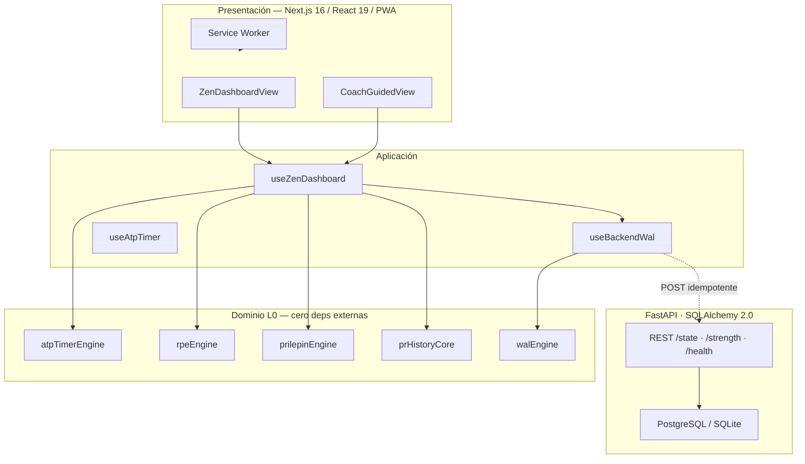

<!-- markdownlint-disable-next-line MD041 -->
<a id="top"></a>

<div align="center">


<h1>ATP-STRENGTH</h1>

<p><strong>La sesión de fuerza máxima que funciona aunque la red no lo haga.</strong></p>

<p>
<a href="https://github.com/valentinflorezarbelaez-ai/ATP-STRENGTH/actions/workflows/ci.yml"></a>
<a href="https://atp-strength.vercel.app/"></a>


<a href="LICENSE"></a>
</p>

<p>
<a href="https://atp-strength.vercel.app/"><strong>App</strong></a> &bull;
<a href="#get-started"><strong>Quickstart</strong></a> &bull;
<a href="MANUAL_DE_OPERACION.md"><strong>Manual</strong></a> &bull;
<a href="CONTRIBUTING.md"><strong>Contribuir</strong></a>
</p>

<br/>

<p>
Las apps de gym te piden internet, un catálogo cerrado y porcentajes genéricos.
<strong>ATP-STRENGTH te pide un ejercicio, un PR, y te da fases al 90&nbsp;% con descanso bioenergético — en el dispositivo, sin drama.</strong>
</p>

<sub><strong>Local-first · PWA · motores L0 puros · evidencia automatizada</strong></sub>

<br/><br/>

<sub><strong>SUPERFICIES EN PRODUCCIÓN</strong></sub>

<strong><a href="https://atp-strength.vercel.app/forge">La Forja</a></strong> ·
<strong><a href="https://atp-strength.vercel.app/">Templo / Sesión</a></strong> ·
<strong><a href="https://atp-strength.vercel.app/calc">Calculadora</a></strong>

<sub>Frontend en Vercel · API en Render / Docker · <a href="#architecture">arquitectura →</a></sub>

</div>

<div align="center"></div>

## Features

---

### Sesión — Un ejercicio, un PR, fases al 90&nbsp;%

Escribís el ejercicio (no hace falta que esté en un catálogo) y tu PR. Si no lo sabés, «Ayudar a sacar el PR» estima con Epley (`peso × (1 + reps / 30)`, un decimal). «Confirmar» guarda ese número en el dispositivo y abre las fases al 90&nbsp;% de ese PR. La fase 4 es la serie fuerte.

**[Manual de operación →](MANUAL_DE_OPERACION.md)**

---

### Descanso — Un solo reloj, bioenergía ATP-CP

Cada serie abre un único reloj de descanso (3–5 min para resíntesis ATP-CP). Controles: «Listo», «Pausar» / «Seguir», «+30 s». Pausar no cierra el reloj. Coach, modo pro y `/calc` comparten el mismo cronómetro.

**[Manual de operación →](MANUAL_DE_OPERACION.md)**

---

### Local-first — Tus marcas viven en el dispositivo

Los PRs de sesión se guardan en el dispositivo. Si el backend no responde, Progreso lo dice en una frase y muestra las marcas locales — nunca como un historial vacío. Exportación JSON/CSV desde el perfil («Copias en este dispositivo»).

**[Política de seguridad →](SECURITY.md)**

---

### PWA anti Lie-Fi — El sótano no te saca de la sesión

Service Worker con carrera de red acotada: si la señal del gimnasio se congela, entrega caché sin bloquear la UI. La sesión sigue; la sincronización espera.

**[Manual de operación →](MANUAL_DE_OPERACION.md)**

---

### Motores científicos — INOL, RPE y supercompensación

| Motor | Qué resuelve |
| :--- | :--- |
| **INOL (Prilepin)** | Estrés neuromuscular acumulado; zona óptima 0.40–1.00 |
| **RPE / RIR (Tuchscherer)** | Ajuste serie a serie del e1RM y la carga siguiente |
| **SPEC-0009** | Detección de PR, curva Bézier de e1RM y tendencia |
| **WAL offline** | Cola idempotente con backoff, jitter y `X-Idempotency-Key` |

Los motores de dominio son ECMAScript puro (capa L0): sin React, sin DOM, sin `node_modules`. Probables en aislamiento.

**[Arquitectura →](#architecture)**

---

### Cinco sistemas de entrenamiento

| ID | Programa | Enfoque |
| :--- | :--- | :--- |
| `warrior` | Forja del Guerrero | Fuerza funcional y compuestos |
| `classic` | Ciclo Clásico | Fuerza pura (sentadilla, banca, peso muerto) |
| `olympic` | Ciclo Olímpico | RFD y levantamientos balísticos |
| `hybrid` | Ciclo Híbrido | Hipertrofia y potencia |
| `universal-pr` | Protocolo Universal | Cualquier ejercicio + PR al 90&nbsp;% |

---

### Also in the box

| Componente | Qué hace |
| :--- | :--- |
| **Coach guiado** | Flujo paso a paso con voz bajo demanda |
| **Cockpit Pro** | Vista densa con gráficos SVG (curva + radar) |
| **Calculadora `/calc`** | Fases y descanso sin salir del reloj de sesión |
| **Himno de la Forja** | Silencio hasta «Poner el himno» — sin descarga anticipada |
| **Docker Compose** | Frontend + backend en un comando |
| **CI dual** | Node 20/22 + Python 3.11/3.12 en paralelo |

<div align="right"><a href="#top">Back to top</a></div>

<div align="center"></div>

## Get started

<a id="get-started"></a>

```bash
# Clonar
git clone https://github.com/valentinflorezarbelaez-ai/ATP-STRENGTH.git
cd ATP-STRENGTH

# Frontend
cd atp-strength-frontend
npm install
npm run dev          # http://localhost:3000
```

```bash
# Stack completo (frontend + API)
docker compose up --build -d
```

```bash
# Verificar
cd atp-strength-frontend && npm test && npm run lint && npm run build
cd ../atp-strength-backend && pytest tests/ -v
```

Sin `NEXT_PUBLIC_API_URL`, el cliente intenta `http://localhost:8000`. Si ese servidor no responde, la sesión sigue con las marcas del dispositivo.

| Servicio | Local | Producción |
| :--- | :--- | :--- |
| **Sesión / Templo** | `http://localhost:3000` | [atp-strength.vercel.app](https://atp-strength.vercel.app) |
| **Forja** | `http://localhost:3000/forge` | [/forge](https://atp-strength.vercel.app/forge) |
| **Calculadora** | `http://localhost:3000/calc` | [/calc](https://atp-strength.vercel.app/calc) |
| **API docs** | `http://127.0.0.1:8000/docs` | Render / Docker |
| **Health** | `http://127.0.0.1:8000/health` | Backend healthcheck |

> **Operación diaria: [Manual →](MANUAL_DE_OPERACION.md) · Contribuciones: [CONTRIBUTING.md](CONTRIBUTING.md) · Seguridad: [SECURITY.md](SECURITY.md)**

<div align="right"><a href="#top">Back to top</a></div>

<div align="center"></div>

## Architecture

<a id="architecture"></a>

Arquitectura hexagonal con dominio L0 puro:


```mermaid
graph TD
    subgraph Presentación["Presentación — Next.js 16 / React 19 / PWA"]
        UI_Zen["ZenDashboardView"]
        UI_Coach["CoachGuidedView"]
        UI_SW["Service Worker"]
    end

    subgraph Aplicación["Aplicación"]
        H_Dash["useZenDashboard"]
        H_WAL["useBackendWal"]
        H_Timer["useAtpTimer"]
    end

    subgraph Dominio["Dominio L0 — cero deps externas"]
        D_Timer["atpTimerEngine"]
        D_WAL["walEngine"]
        D_RPE["rpeEngine"]
        D_Prilepin["prilepinEngine"]
        D_PR["prHistoryCore"]
    end

    subgraph Backend["FastAPI · SQLAlchemy 2.0"]
        B_API["REST /state · /strength · /health"]
        B_DB["PostgreSQL / SQLite"]
    end

    UI_Zen --> H_Dash
    UI_Coach --> H_Dash
    H_Dash --> D_Timer
    H_Dash --> D_RPE
    H_Dash --> D_Prilepin
    H_Dash --> D_PR
    H_Dash --> H_WAL
    H_WAL --> D_WAL
    H_WAL -.->|POST idempotente| B_API
    B_API --> B_DB
    UI_SW -.-> Presentación
```

- **L0:** lógica de fuerza, tiempo y sync sin framework.
- **Idempotencia:** cada sync lleva `client_sync_id` / `X-Idempotency-Key`.
- **Calidad de puerta:** `npm run lint` y `npm run build` (Turbopack) sin errores ni avisos.

<div align="right"><a href="#top">Back to top</a></div>

<div align="center"></div>

## Quality

| Capa | Stack | Alcance |
| :--- | :--- | :--- |
| **Dominio L0** | Node test runner | Timer, WAL, Prilepin, RPE, programas, historial PR |
| **E2E** | Playwright (Chromium) | Shell PWA, offline, gráficos |
| **Backend** | Pytest + TestClient | Rutas REST, persistencia, aislamiento |

```bash
cd atp-strength-frontend && npm test && npm run test:e2e
cd atp-strength-frontend && npm run lint && npx tsc --noEmit
cd atp-strength-backend && pytest tests/ -v
cd atp-strength-backend && python -m ruff check . && python -m ruff format --check .
```

<div align="right"><a href="#top">Back to top</a></div>

<div align="center"></div>

## Documentation

| Dónde ir | Qué encontrás |
| :--- | :--- |
| **[Manual de operación](MANUAL_DE_OPERACION.md)** | Flujo de sesión, forja, voz, progreso |
| **[Manual interactivo](MANUAL_INTERACTIVO.html)** | Guía HTML embebida |
| **[CONTRIBUTING.md](CONTRIBUTING.md)** | Doctrina L0, commits, checklist de PR |
| **[SECURITY.md](SECURITY.md)** | Versiones soportadas y reporte de fallos |
| **[LICENSE](LICENSE)** | MIT |

<div align="right"><a href="#top">Back to top</a></div>

<div align="center"></div>

## Privacy & security

- Marcas de sesión en el dispositivo; exportación bajo control del atleta.
- Sin telemetría comercial de terceros ni cookies de seguimiento.
- Dependencias del frontend auditables; Next.js fijado en la línea 16.3.x.
- Usuarios no-root en las imágenes Docker multi-stage.

**[SECURITY.md →](SECURITY.md)**

<div align="right"><a href="#top">Back to top</a></div>

<div align="center"></div>

## License

MIT. Ver [LICENSE](LICENSE).

Construido por [Valentín Flórez Arbeláez](https://github.com/valentinflorezarbelaez-ai).

<div align="center">

<sub>ATP-STRENGTH — fuerza con evidencia, no con promesas.</sub>

</div>
